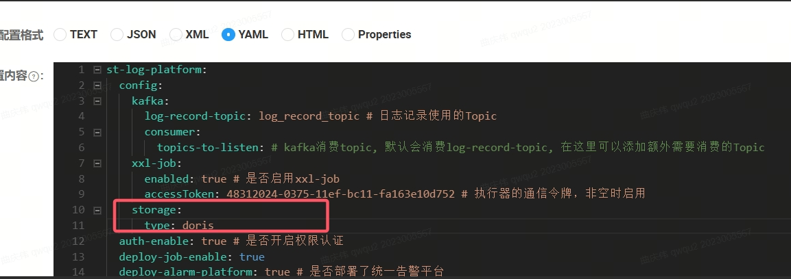
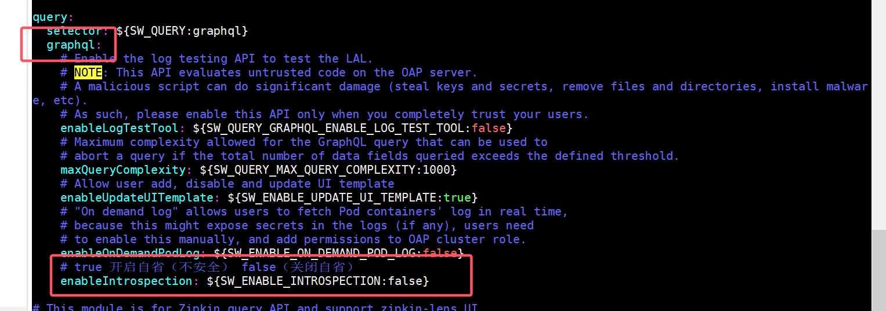

## 1. 权限系统升级

### 备份数据库

手动备份数据库

### 执行升级脚本

#### 若使用 Mysql 数据库，执行 SQL：

SQL 文件地址：发布包 / 05\_升级脚本 / aiops_resource_V4.0.8_to_V4.0.9-upgrader-mysql.sql

#### 若使用达梦数据库，执行 SQL：

SQL 文件地址：发布包 / 05\_升级脚本 / aiops_resource_V4.0.8_to_V4.0.9-upgrader-dm.sql

### 升级 auth-all 组件

### 停止 auth-all 进程并备份部署包

```
cd /path/auth-all/
./run.sh stop
cd ..
mv auth-all auth-all.bak
```

### 上传新部署包并解压

```
unzip auth-all.zip
cd auth-all
```

### 将备份包中的 config 下的 bootstrap.yml 复制到新的部署包中

```
cp /path/auth-all.bak/config/bootstrap.yml ./config/bootstrap.yml
```

### 修改 application.yaml 配置文件

- 在 nacos 管理台上修改 group 是 auth-all 的 application.yaml 文件

1. 找到 spring.jackson 的所有子配置并删除

```
spring:
  jackson:
    time-zone: GMT+8
    date-format: yyyy-MM-dd HH:mm:ss
```

2. 在 inner:auth:excludeUrls 配置后增加 ,/metaAndMenu/\*\*配置

```
inner:
  auth:
    excludeUrls: /login,/captcha,/logout,/refreshToken,/loginInfo,/authChange,/authentication/authorization/applications,/authentication/authorization/dataGroups,
    /authentication/authorization/dataGroupName,/permission/**,/metaAndMenu/** # 认证和授权不进行拦截的路径
```

3. 增加 nginx:url 配置，127.0.0.1 替换成 nginx 所在 ip 地址，80 替换成 nginx 监听的端口号，如果 ip 配置了域名，则相应的这里填写域名，以访有跨域的问题

```
nginx:
 url: http://127.0.0.1:80
```

### 启动服务

```
./run.sh start
```

### 启动成功验证

- 检查./logs 下有没有错误日志和查看 auth-all 进程是否被拉起

```
ps -ef |grep auth-all
```

## 2. Doris 升级

关闭使用 Doris 的服务(日志后台服务和告警服务), 避免升级过程中读写数据

### 一、元数据备份

将 FE-Master 节点的 doris-meta 目录进行完整备份！

```bash
cp -r ${DORIS_OLD_HOME}/fe/doris-meta ${DORIS_OLD_HOME}/fe/doris-meta.bak
```

### 二、关闭集群副本修复和均衡功能

```bash
#通过MySQL命令行客户端连接doris
mysql -uroot -P9030 -h127.0.0.1

#执行
admin set frontend config("disable_balance" = "true");
admin set frontend config("disable_colocate_balance" = "true");
admin set frontend config("disable_tablet_scheduler" = "true");
```

通过 Doris FE 的 Configuration 页面可以看到配置是否更改成功

### 三、升级 BE

为了保证您的数据安全，请使用 3 副本来存储您的数据，以避免升级误操作或失败导致的数据丢失问题

3.1 在多副本的前提下，选择一台 BE 节点停止运行，进行灰度升级

```bash
sh ${DORIS_OLD_HOME}/be/bin/stop_be.sh
```

3.2 重命名 BE 目录下的 /bin，/lib 目录

```bash
mv ${DORIS_OLD_HOME}/be/bin ${DORIS_OLD_HOME}/be/bin_back
mv ${DORIS_OLD_HOME}/be/lib ${DORIS_OLD_HOME}/be/lib_back
```

3.3 复制新版本的 /bin，/lib 目录到原 BE 目录下

```bash
cp -r ${DORIS_NEW_HOME}/be/bin ${DORIS_OLD_HOME}/be/bin
cp -r ${DORIS_NEW_HOME}/be/lib ${DORIS_OLD_HOME}/be/lib
```

3.4 启动该 BE 节点

```bash
sh ${DORIS_OLD_HOME}/be/bin/start_be.sh --daemon
```

3.5 查看是否启动成功

```bash
jps -l |grep DorisBE
```

或者

```
#连接doris
mysql -uroot -P9030 -h127.0.0.1

show backends\G
```

若该 BE 节点 alive 状态为 true，且 Version 值为新版本，则该节点升级成功

3.6 若存在其他 BE 节点，依次完成其他 BE 节点升级

### 四、升级 FE

先升级非 Master 节点，后升级 Master 节点。

4.1 多个 FE 节点情况下，选择一个非 Master 节点进行升级，先停止运行

```shell
sh ${DORIS_OLD_HOME}/fe/bin/stop_fe.sh
```

4.2 重命名 FE 目录下的 /bin，/lib，/mysql_ssl_default_certificate 目录

```shell
mv ${DORIS_OLD_HOME}/fe/bin ${DORIS_OLD_HOME}/fe/bin_back
mv ${DORIS_OLD_HOME}/fe/lib ${DORIS_OLD_HOME}/fe/lib_back
mv ${DORIS_OLD_HOME}/fe/mysql_ssl_default_certificate ${DORIS_OLD_HOME}/fe/mysql_ssl_default_certificate_back
```

4.3 复制新版本的 /bin，/lib，/mysql_ssl_default_certificate 目录到原 FE 目录下

```shell
cp -r ${DORIS_NEW_HOME}/fe/bin ${DORIS_OLD_HOME}/fe/bin
cp -r ${DORIS_NEW_HOME}/fe/lib ${DORIS_OLD_HOME}/fe/lib
cp -r ${DORIS_NEW_HOME}/fe/mysql_ssl_default_certificate ${DORIS_OLD_HOME}/fe/mysql_ssl_default_certificate
```

4.4 启动该 FE 节点

```shell
sh ${DORIS_OLD_HOME}/fe/bin/start_fe.sh --daemon
```

4.5 查看是否启动成功

```bash
jps -l |grep DorisFE
```

或者

```
#连接doris
mysql -uroot -P9030 -h127.0.0.1

show frontends\G
```

若该 FE 节点 alive 状态为 true，且 Version 值为新版本，则该节点升级成功

4.6 若存在其他节点，依次完成其他 FE 节点升级，**最后完成 Master 节点的升级**

### 五、打开集群副本修复和均衡功能

升级完成，并且所有 BE 节点状态变为 Alive 后，打开集群副本修复和均衡功能：

```sql
#连接doris
mysql -uroot -P9030 -h127.0.0.1

#执行
admin set frontend config("disable_balance" = "false");
admin set frontend config("disable_colocate_balance" = "false");
admin set frontend config("disable_tablet_scheduler" = "false");
```

### 六、启动使用 Doris 的服务(日志后台服务和告警服务)

## 3. 日志服务系统升级

### **_第一步_**：查找原部署安装目录

```
jps -l | grep st-logplatform-service.jar #获取进程id
pwdx 进程id #获取部署目录
```

### **_第二步_**：停止并备份原服务

在日志服务 st-logplatform-service 目录下执行

`sh run.sh stop #停止日志服务`

回到上层目录执行备份

`mv st-logplatform-service st-logplatform-service.bak
`

### **_第三步_**：部署 4.0.9 版本包并修改配置文件

解压部署包

`unzip st-logplatform-service.zip`

进入解压后的目录

`cd st-logplatform-service`

删除 config 下的.yml 文件

`rm -rf config/*.yml`

从备份包中复制 config 下的.yml 文件到当前 config 下

`cp /path/st-logplatform-service.bak/config/*.yml ./config`

更新 nacos 配置

到命名空间为`st-observable`, group 为`ST-LOG-PLATFORM`，Data Id 为`application-startrace.yml`的配置中新增以下配置

```yaml
st-log-platform.config.storage.type: doris
```



启动服务

`sh run.sh start`

## 4. 调用链系统升级

**_第一步_**：查找原部署安装目录

```
#获取进程id
jps -l | grep skywalking
#获取部署目录
pwdx 进程id
```

**_第二步_**：停止并备份原部署包

```
#停止调用链服务
kill -9 进程id
# 进入部署目录进行备份
mv apache-skywalking-apm-bin apache-skywalking-apm-bin.bak
```

**_第三步_**：部署 4.0.9 版本包并修改配置文件

1. 根据机器系统架构分别到 01_X86 架构的包或者 02_ARM 架构的包下找服务部署包

- 下文以 x86 系统架构的包名为例

```
解压部署包
tar -zxvf apache-skywalking-apm-bin-amd.tar.gz
进入解压后的目录
cd apache-skywalking-apm-bin-amd
```

2. 将备份包中的 config 下的 application.yml 复制到当前目录

```
cp -r /path/apache-skywalking-apm-bin.bak/config/application.yml ./config/application.yml
```

3. 检查 application.yml 配置文件是否包含 enableIntrospection 配置项 如果没有请添加

```
# true 开启自省（不安全） false（关闭自省）
enableIntrospection: ${SW_ENABLE_INTROSPECTION:false}
```

具体配置位置如图所示：

4. 修改当前目录的 auth-settings.yml,auth：url 的 127.0.0.1:9004 配成成 auth-all(权限服务)的 ip 加 port,如果 auth-all 是多节点部署可配置成 ng 代理地址

```
vim ./config/auth-settings.yml
```

```
#鉴权服务 switch开启后拦截所有/graphql请求 到auth服务做鉴权
auth:
  url: http://127.0.0.1:9004/auth
  #开关 默认开启
  switch: true
```

***第四步*可选升级\_**
注意：4.0.9 版本 oap 支持 doris 存储 若不启用 doris 存储请略过此步骤

1. 启用 doris 存储 修改 application.yml 配置文件（注意：doris 存储与 elasticsearch 存储只能二选一）
2. 需要提前在 doris 中创建名为 skywalking 的库

```bash
storage:
  selector: ${SW_STORAGE:elasticsearch}
  doris:
    properties:
      jdbcUrl: ${SW_JDBC_URL:"jdbc:mysql://localhost:9030/skywalking?rewriteBatchedStatements=true&connectTimeout=30000&sessionVariables=group_commit=async_mode&useUnicode=true&characterEncoding=utf8&useTimezone=true&serverTimezone=Asia/Shanghai&useSSL=false&allowPublicKeyRetrieval=true"}
      dataSource.user: ${SW_DATA_SOURCE_USER:root}
      dataSource.password: ${SW_DATA_SOURCE_PASSWORD:}
      dataSource.cachePrepStmts: ${SW_DATA_SOURCE_CACHE_PREP_STMTS:true}
      dataSource.prepStmtCacheSize: ${SW_DATA_SOURCE_PREP_STMT_CACHE_SQL_SIZE:250}
      dataSource.prepStmtCacheSqlLimit: ${SW_DATA_SOURCE_PREP_STMT_CACHE_SQL_LIMIT:2048}
      dataSource.useServerPrepStmts: ${SW_DATA_SOURCE_USE_SERVER_PREP_STMTS:true}
      dataSource.socketTimeout: ${SW_DATA_SOURCE_SOCKET_TIMEOUT:300000}
    metadataQueryMaxSize: ${SW_STORAGE_MYSQL_QUERY_MAX_SIZE:5000}
    maxSizeOfBatchSql: ${SW_STORAGE_MAX_SIZE_OF_BATCH_SQL:2000}
    asyncBatchPersistentPoolSize: ${SW_STORAGE_ASYNC_BATCH_PERSISTENT_POOL_SIZE:4}
    #doris stream load 写入开关 默认为false 起到兼容其他storage作用 若其他storage 缺省该配置则BatchSQLExecutor执行器批量提交不启用doris 的stream load
    dorisStreamLoadSwitch: ${SW_STORAGE_DORIS_STREAM_LOAD_SWITCH:true}
    # doris stream load 最大容忍可过滤（数据不规范等原因）的数据比例,取值范围是0~1,例如:0.1
    dorisStreamLoadMaxFilterRatio: ${SW_STORAGE_DORIS_STREAM_LOAD_MAX_FILTER_RATIO:0}
    # doris 如果 OLAP 表的是 Random Distribution 的数据分布，那么在数据导入的时候可以设置单分片导入模式（将 load_to_single_tablet 设置为 true），那么在大数据量的导入的时候，一个任务在将数据写入对应的分区时将只写入一个分片，这样将能提高数据导入的并发度和吞吐量，减少数据导入和 Compaction 导致的写放大问题，保障集群的稳定性。
    dorisStreamloadLoadToSingleTablet: ${SW_STORAGE_DORIS_STREAM_LOAD_LOAD_TO_SINGLE_TABLET:false}
    # doris stream load 提交端口
    dorisStreamloadPort: ${SW_STORAGE_DORIS_STREAM_LOAD_PORT:8030}
```

**_第五步_**：登录 nacos 管理台修改配置

1. 找到 Group 是 skywalking-oap,Data Id 是 alarm.default.alarm-settings 的配置文件
2. 将 webhooks 配置端口从 9100 修改成 19000

**_第六步_**：启动服务 #在 apache-skywalking-apm-bin/bin 目录下执行启动命令

```
sh oapService.sh
```

**_第七步_**：执行优化脚本
注意：4.0.9 版本 oap 支持 doris 存储 若不启用 doris 存储请略过此步骤
启动 oap 等待应用启动完毕， 访问 doris 管理台 http://localhost:8030 在 skywalking 库中执行以下 sql 命令用于提升性能

```bash
ALTER TABLE segment set ("group_commit_interval_ms" = "30000");
ALTER TABLE segment set ("group_commit_data_bytes" = "134217728");
ALTER TABLE segment_tag set ("group_commit_interval_ms" = "30000");
ALTER TABLE segment_tag set ("group_commit_data_bytes" = "134217728");
```

**_第八步_**：启动成功验证

- 检查./logs 下有没有错误日志和查看 oap 进程是否被拉起

```
ps -ef |grep oap
```

## 5. 告警升级

### 准备

```
1、新的部署包alarm-all.zip：
发布包 / 03_公共包 / 02_服务部署包 / alarm-all.zip

2、新的告警分析数据库初始化SQL aiops_alarm_analyser_doris.init.sql：
发布包 / 03_公共包 / 02_服务部署包 / alarm-all.zip（解压后得到alarm-all） / config / doc / sql / aiops_alarm_analyser_doris.init.sql
```

### 停服

```
# 获取进程id
[root@master ~]# jps -l | grep alarm-all
11410 /data/service/alarm-all/alarm-all-1.0.jar

# 获取部署目录（此处路径是示例）
[root@master ~]# pwdx 11410
11410: /data/service/alarm-all

# 停服
[root@master ~]# cd /data/service/alarm-all
[root@master alarm-all]# ./run.sh stop

# 检查进程已不存在
[root@master alarm-all]# jps -l | grep alarm-all
[root@master alarm-all]#
```

### 数据库调整

**_第一步_**：调整告警分析数据库（以下命令在 Doris FE 前端页面操作，已包含备份指令，页面执行时需先鼠标左击以选中 aiops_alarm 库）

```
# 修改原库名，做备份，也做迁移的源数据
ALTER DATABASE aiops_alarm RENAME aiops_alarm_v408_bak;

# 执行doris数据库初始化脚本`aiops_alarm_analyser_doris.init.sql`，重新创建数据库aiops_alarm
# 脚本位置：参考准备步骤

# 迁移数据
INSERT INTO aiops_alarm.`event`(event_id,origin_event_id,content) SELECT event_id,origin_event_id,content FROM aiops_alarm_v408_bak.`event`;
INSERT INTO aiops_alarm.alarm(alarm_id,event_id,workspace_id,data_group_id,data_group_name,origin,token,trigger_time,`level`,content,cate,`source`,labels,create_time) SELECT alarm_id,event_id,workspace_id,data_group_id,data_group_name,origin,token,trigger_time,`level`,content,cate,`source`,labels,create_time FROM aiops_alarm_v408_bak.alarm;
INSERT INTO aiops_alarm.alarm_unique(alarm_id,workspace_id,origin,data_group_id,data_group_name,first_trigger_time,agg_assign_rule_id,trigger_time,`level`,content,cate,`source`,block_rule_id,block_rule_name,is_blocked,num,state,labels,create_time,update_time,updater) SELECT alarm_id,workspace_id,origin,data_group_id,data_group_name,first_trigger_time,agg_assign_rule_id,trigger_time,`level`,content,cate,`source`,block_rule_id,block_rule_name,is_blocked,num,state,ifnull(labels,'{}'),create_time,update_time,updater FROM aiops_alarm_v408_bak.alarm_unique;
INSERT INTO aiops_alarm.alarm_agg(alarm_id,workspace_id,first_trigger_time,is_agg,close_time,close_reason,ack_time,ack_desc,`level`,content,cate,`source`,state,labels,assign_rule_id,assign_rule_name,notify_group_id,notify_group_name,num,create_time,update_time,updater) SELECT alarm_id,workspace_id,first_trigger_time,is_agg,close_time,close_reason,ack_time,ack_desc,`level`,content,cate,`source`,state,ifnull(labels,'{}'),assign_rule_id,assign_rule_name,notify_group_id,notify_group_name,num,create_time,update_time,updater FROM aiops_alarm_v408_bak.alarm_agg;
INSERT INTO aiops_alarm.alarm_agg_unique(agg_id,unique_id,`state`) SELECT agg_id,unique_id,`state` FROM aiops_alarm_v408_bak.alarm_agg_unique;
INSERT INTO aiops_alarm.notice(notice_id,alarm_id,workspace_id,content,cate,`level`,`status`,notify_id,notify_name,notify_group_id,notify_group_name,create_time) SELECT notice_id,alarm_id,workspace_id,content,cate,`level`,`status`,notify_id,notify_name,notify_group_id,notify_group_name,create_time FROM aiops_alarm_v408_bak.notice;
```

**_第二步_**：调整告警管理数据库（**需先备份数据库**）

如果告警管理数据库是 DM 数据库（结尾 COMMIT 不能漏了）：

```
SET SCHEMA AIOPS_ALARM;
ALTER TABLE AIOPS_ALARM.CUSTOM_LABEL DROP CONSTRAINT CUSTOM_LABEL_PK;
ALTER TABLE AIOPS_ALARM.CUSTOM_LABEL DROP CONSTRAINT CUSTOM_LABEL_PK2;

DELETE FROM "AIOPS_ALARM"."LABEL_TPL";

SET
    IDENTITY_INSERT "AIOPS_ALARM"."LABEL_TPL" ON;
INSERT INTO "AIOPS_ALARM"."LABEL_TPL"("ID","CONTENT","SOURCE","CATE","CREATOR","UPDATER","CREATE_TIME","UPDATE_TIME") VALUES(2,'{"id":405578,"cate":"prometheus","group_id":0,"group_name":"默认业务组","hash":"922cc804094e0880d5f232f9fb1cfba7","rule_id":65,"rule_name":"CPU告警","rule_note":"","rule_prod":"metric","rule_algo":"","severity":3,"prom_for_duration":60,"prom_ql":"cpu_usage_total >1","rule_config":{"queries":[{"prom_ql":"cpu_usage_total >1","severity":3}]},"prom_eval_interval":30,"callbacks":[],"runbook_url":"","notify_recovered":1,"notify_channels":["email","sms"],"notify_groups":[],"notify_groups_obj":[],"target_ident":"observability-119","target_note":"","trigger_time":1722406785,"trigger_value":"13.13349","tags":["__name__=cpu_usage_total","cpu=cpu-total","data_group=tok_4f4c61eabe01436091d9ce1a77be1aba","host=observability-119","host_ip=172.29.228.119/24","ident=observability-119","key=host","rulename=CPU告警"],"annotations":{},"is_recovered":false,"notify_users_obj":[],"last_eval_time":1722406785,"last_escalation_notify_time":0,"last_sent_time":1722406785,"notify_cur_number":505,"first_trigger_time":1722391665,"extra_config":null,"status":0,"claimant":"","sub_rule_id":0,"ack_time":0,"ack_state":0,"data_group":"tok_4f4c61eabe01436091d9ce1a77be1aba"}',0,1,'admin','admin',TO_DATE('2024-07-03 15:31:18','YYYY-MM-DD HH24:MI:SS.FF'),TO_DATE('2024-07-03 15:31:18','YYYY-MM-DD HH24:MI:SS.FF'));
INSERT INTO "AIOPS_ALARM"."LABEL_TPL"("ID","CONTENT","SOURCE","CATE","CREATOR","UPDATER","CREATE_TIME","UPDATE_TIME") VALUES(4,'{"eventId":"20240731102222_service_sla1722218654779_rule_YWxhcm18dG9rXzNkYzJhNWUxNDU3NzQ0Mzc5ZGFkNjRlNWRhNjlkZjE4fA==.1_","origin":"6070ff7784a104269ed03ef6ed2de19a","triggerTime":1722392542904,"level":3,"content":"alarm服务成功率小于100%","scope":"SERVICE","applicationName":"alarm|tok_3dc2a5e1457744379dad64e5da69df18|","ruleName":"service_sla1722218654779_rule"}',0,2,'admin','admin',TO_DATE('2024-07-02 17:40:57','YYYY-MM-DD HH24:MI:SS.FF'),TO_DATE('2024-07-02 17:40:57','YYYY-MM-DD HH24:MI:SS.FF'));
INSERT INTO "AIOPS_ALARM"."LABEL_TPL"("ID","CONTENT","SOURCE","CATE","CREATOR","UPDATER","CREATE_TIME","UPDATE_TIME") VALUES(6,'{"eventId":"25d8c275-b850-4394-8819-8e6f35491b04","applicationName":"alarm","origin":"f0c9d58b-31f0-49c7-b236-b8b47305c7fd","triggerTime":1722407054039,"level":1,"title":"alarm_15应用日志告警","content":"alarm日志告警"}',0,3,'admin','admin',TO_DATE('2024-07-03 15:30:16','YYYY-MM-DD HH24:MI:SS.FF'),TO_DATE('2024-07-03 15:30:16','YYYY-MM-DD HH24:MI:SS.FF'));
INSERT INTO "AIOPS_ALARM"."LABEL_TPL"("ID","CONTENT","SOURCE","CATE","CREATOR","UPDATER","CREATE_TIME","UPDATE_TIME") VALUES(8,'{"origin":"a738ddc557b9e1b649008f2e9d314734","id":"9410a428e98f514eada75f2d1908b55b","task_name":"python3存在和不存在","point_name":"172.31.186.189_node1","ident":"node1","url":"","lx":"SCRIPT","frequency":"5m","trigger_time":1722406629419,"fail_reason":"errMsg:请求结果为空","rule_content":"{\"success_when\":[{\"custom_field\":{},\"result\":[],\"success\":[{\"contains\":\"0\"}]}],\"success_when_logic\":\"and\",\"script_type\":\"python3\",\"script_content\":\"import time\\nimport json\\n\\ntime.sleep(6)\\nsuccess = 0\\nresult = \\\"kkk\\\"\\nerrMsg = \\\"请求结果为空\\\"\\noutput = {\\\"success\\\":success, \\\"result\\\":result, \\\"errMsg\\\":errMsg}\\nprint(json.dumps(output))\",\"exec_user\":\"root\"}"}',0,4,'admin','admin',TO_DATE('2024-07-03 15:30:40','YYYY-MM-DD HH24:MI:SS.FF'),TO_DATE('2024-07-03 15:30:40','YYYY-MM-DD HH24:MI:SS.FF'));
SET
    IDENTITY_INSERT "AIOPS_ALARM"."LABEL_TPL" OFF;
COMMIT;
```

如果告警管理数据库是 Mysql 数据库：

```
DELETE FROM aiops_alarm.label_tpl;

INSERT INTO aiops_alarm.label_tpl (id, content, source, cate, create_time, creator, update_time, updater) VALUES (2, '{"id":405578,"cate":"prometheus","group_id":0,"group_name":"默认业务组","hash":"922cc804094e0880d5f232f9fb1cfba7","rule_id":65,"rule_name":"CPU告警","rule_note":"","rule_prod":"metric","rule_algo":"","severity":3,"prom_for_duration":60,"prom_ql":"cpu_usage_total >1","rule_config":{"queries":[{"prom_ql":"cpu_usage_total >1","severity":3}]},"prom_eval_interval":30,"callbacks":[],"runbook_url":"","notify_recovered":1,"notify_channels":["email","sms"],"notify_groups":[],"notify_groups_obj":[],"target_ident":"observability-119","target_note":"","trigger_time":1722406785,"trigger_value":"13.13349","tags":["__name__=cpu_usage_total","cpu=cpu-total","data_group=tok_4f4c61eabe01436091d9ce1a77be1aba","host=observability-119","host_ip=172.29.228.119/24","ident=observability-119","key=host","rulename=CPU告警"],"annotations":{},"is_recovered":false,"notify_users_obj":[],"last_eval_time":1722406785,"last_escalation_notify_time":0,"last_sent_time":1722406785,"notify_cur_number":505,"first_trigger_time":1722391665,"extra_config":null,"status":0,"claimant":"","sub_rule_id":0,"ack_time":0,"ack_state":0,"data_group":"tok_4f4c61eabe01436091d9ce1a77be1aba"}', 0, 1, '2024-07-02 17:40:57', 'admin', '2024-07-02 17:40:57', 'admin');
INSERT INTO aiops_alarm.label_tpl (id, content, source, cate, create_time, creator, update_time, updater) VALUES (4, '{"eventId":"20240731102222_service_sla1722218654779_rule_YWxhcm18dG9rXzNkYzJhNWUxNDU3NzQ0Mzc5ZGFkNjRlNWRhNjlkZjE4fA==.1_","origin":"6070ff7784a104269ed03ef6ed2de19a","triggerTime":1722392542904,"level":3,"content":"alarm服务成功率小于100%","scope":"SERVICE","applicationName":"alarm|tok_3dc2a5e1457744379dad64e5da69df18|","ruleName":"service_sla1722218654779_rule"}', 0, 2, '2024-07-03 15:30:16', 'admin', '2024-07-03 15:30:16', 'admin');
INSERT INTO aiops_alarm.label_tpl (id, content, source, cate, create_time, creator, update_time, updater) VALUES (6, '{"eventId":"25d8c275-b850-4394-8819-8e6f35491b04","applicationName":"alarm","origin":"f0c9d58b-31f0-49c7-b236-b8b47305c7fd","triggerTime":1722407054039,"level":1,"title":"alarm_15应用日志告警","content":"alarm日志告警"}', 0, 3, '2024-07-03 15:30:40', 'admin', '2024-07-03 15:30:40', 'admin');
INSERT INTO aiops_alarm.label_tpl (id, content, source, cate, create_time, creator, update_time, updater) VALUES (8, '{"origin":"a738ddc557b9e1b649008f2e9d314734","id":"9410a428e98f514eada75f2d1908b55b","task_name":"python3存在和不存在","point_name":"172.31.186.189_node1","ident":"node1","url":"","lx":"SCRIPT","frequency":"5m","trigger_time":1722406629419,"fail_reason":"errMsg:请求结果为空","rule_content":"{\\"success_when\\":[{\\"custom_field\\":{},\\"result\\":[],\\"success\\":[{\\"contains\\":\\"0\\"}]}],\\"success_when_logic\\":\\"and\\",\\"script_type\\":\\"python3\\",\\"script_content\\":\\"import time\\\\nimport json\\\\n\\\\ntime.sleep(6)\\\\nsuccess = 0\\\\nresult = \\\\\\"kkk\\\\\\"\\\\nerrMsg = \\\\\\"请求结果为空\\\\\\"\\\\noutput = {\\\\\\"success\\\\\\":success, \\\\\\"result\\\\\\":result, \\\\\\"errMsg\\\\\\":errMsg}\\\\nprint(json.dumps(output))\\",\\"exec_user\\":\\"root\\"}"}', 0, 4, '2024-07-03 15:31:18', 'weipan4', '2024-07-03 15:31:18', 'weipan4');
```

### 告警组件更新

**_第一步_**：停服（前面步骤已实现停服）

**_第二步_**：备份

```
# 进入alarm-all上级目录（此处路径是示例）
[root@master alarm-all]# cd /data/service/

# 改名作备份
[root@master service]# mv alarm-all alarm-all.bak
```

**_第三步_**：部署升级包

将发布包里的`alarm-all.zip`上传到`/data/service/`下，解压后会生成`alarm-all`文件夹。

1、解压：

```
[root@iflyops-1 service]# cd /data/service/
[root@iflyops-1 service]# unzip alarm-all.zip
```

**_第四步_**：配置 bootstrap.yml 文件修改(需要使用新包里的 bootstrap.yml 文件)

```
[root@iflyops-1 service]# cd /data/service/alarm-all/config
[root@iflyops-1 config]# vim bootstrap.yml
```

- 修改如下三个配置为对应环境的 nacos 配置（此处仅列举了待改项，非全部参数）

```
alarm:
  nacos:
    server-addr: 127.0.0.1:8848
    username: nacos
    password: qLQ6lrSoBkKytbVp
```

**_第五步_**：修改 Nacos 配置

1、备份：通过 Nacos 管理台页面，配置管理/配置列表/导出查询结果，导出命名空间 st-observable 下所有配置。

2、Naocs 上配置列表，在命名空间 st-observable 下，编辑 Group 为 alarm-all,Data Id 为 application.yml 的文件，需要修改的内容如下（此处仅列举了待改项，非全部参数。待改项两个修改，一个新增。注意行缩进与配置文件保持一致）：

```
# 修改端口为19000
server:
  port: 19000

# 修改接口拦截配置（替换指定属性includeUrls全值）
manager:
   auth:
      includeUrls: /assign/policy/**,/block/rule/**,/notice/**,/custom/label/**,/label/tpl/**,/event/**,/monitor/system/**,/notify/channel/**,/decision/condition/**,/notify/group/**,/notify/policy/**,/alarm/**,/statistics/**,/auth/**

# 新增配置（doris批量读写配置，ip、port、账号、密码需修改为正确值）
analyser:
   doris:
      host: 127.0.0.1
      # doris的http端口
      port: 8030
      user: root
      passwd: qLQ6lrSoBkKytbVp
   consumer:
      # 批量消费事件，size和timeout(unit: millisecond)任一条件达成开始处理
      batch:
         size: 100
         timeout: 100
   # 批量写入，size和timeout(unit: millisecond)任一条件达成开始处理
   write:
      batch:
         size: 100
         timeout: 100
```

**_第五步_**：启动服务

```
[root@iflyops-1 service]# cd /data/service/alarm-all
[root@iflyops-1 alarm-all]# sh run.sh start
```

**_第六步_**：访问验证

- alarm-all 服务正常启动

```
ps -ef | grep alarm-all
```

**_第七步_**：失败回滚

1、停服 alarm-all

2、还原告警分析备份库，及告警管理备份库

3、还原修改的 nacos 配置

4、还原 alarm-all 备份包，重启

## 6. nodeman 服务升级

**_第一步_**：停止并备份原服务

```
#停止服务
sh stop.sh
#备份
mv st_nodeman st_nodeman_xxx_bak
```

**_第二步_**：文件替换

从发布包里获取新包，根据 cpu 架构选择 amd64 或者 arm64 部署包，将部署包 nodeman_service.zip 直接在 nodeman-service 目录下解压, 解压过程中只需要替换 st_nodeman 文件就行，其他不用替换。

**_第三步_**：将服务重新启动

```bash
sh start.sh
```

**_第四步_**：验证服务

```bash
ps -ef | grep st_nodeman
```

可以查看到相关进程，说明部署成功

**_失败回滚_**

1、检查服务进程，关闭后删除升级包，并还原备份包和配置，再启动

## 7. gse 服务升级

**_第一步_**：停止并备份原服务

```
#停止服务
sh stop.sh
#备份
mv st_gse st_gse_xxx_bak
```

**_第二步_**：文件替换：

从发布包里获取新包，根据 cpu 架构选择 amd64 或者 arm64 部署包，将部署包 gse_service.zip 直接在 gse-service 目录下解压, 解压过程中只需要替换 st_gse 文件就行，其他不用替换。

**_第三步_**：将服务重新启动

```bash
sh start.sh
```

**_第四步_**：验证服务

```bash
ps -ef | grep st_gse
```

可以查看到相关进程，说明部署成功

**_失败回滚_**

1、检查服务进程，关闭后删除升级包，并还原备份包和配置，再启动。

## 8. 前端升级

**备注：**nginx 部署需要 nginx 添加--with-http_ssl_module、--with-http_v2_module 和--with-http_gzip_static_module 模块。可以通过以下命令查看当前 nginx 是否已安装这些模块

```
cd /**/**/nginx/
./sbin/nginx -V
```

如果没有安装，需要重新编译安装 nginx。安装过程中执行以下命令进行编译

```
./configure --prefix=/data/public/nginx --with-http_ssl_module --with-http_v2_module --with-http_gzip_static_module
```

### 升级说明

前端包里包含 observe-basic-app.zip、observe-config.zip、observe-metric.zip、observe-trace.zip、observe-log.zip、observe-alarm.zip、sop_doc.zip 七个前端资源文件和 nginx.conf 一个 nginx 配置文件。

第一步：进入旧版的前端资源包目录下，将旧版资源包 micro_front_observer 进行备份；

第二步：进入 nginx 安装目录下，建立前端资源包文件夹；

```
cd /**/**/nginx/
mkdir micro_front_observer
cd ./micro_front_observer
mkdir observe-basic-app
mkdir observe-config
mkdir observe-metric
mkdir observe-trace
mkdir observe-log
mkdir observe-alarm
mkdir sop_doc
```

第三步：将前端资源包上传至部署机器。将 observe-basic-app.zip、observe-config.zip、observe-metric.zip、observe-trace.zip、observe-log.zip、observe-alarm.zip、sop_doc.zip 七个前端资源包分别上传至上面对应的文件夹目录下，分别解压资源文件；

第四步：进入/micro_front_observer/observe-basic-app 目录下，打开**config.js**文件， production 对象里**127.0.0.1**改为前端资源包所在部署机器的 ip 或域名；

```json
    "production": {
        "VITE_DOC_URL": "http://127.0.0.1/sop_doc/", // 文档中心部署地址
        "VITE_LOGIN_CONFIG": {
            "mode": "normal", // "normal": 本地登陆 / "sso": sso登陆 / "uap": uap登陆
            "sso_url": "https://ssotest.iflytek.com/sso",
            "uap_url": "http://127.0.0.1:8380/uap-server",
            "app_code": "yy_1704868151449",
            "client_platform": "myuap"
        },
    },
```

第五步：进入/nginx/config 目录下，将原有的 nginx.conf 文件进行备份，上传升级包里的 nginx.conf 文件；

第六步：打开 nginx.conf 文件，将里面的**root**对应的路径里的/data/public/nginx 替换为当前部署机器上的真实 nginx 路径，将文件里面的请求转发地址**127.0.0.1**换成真实的请求地址；

```shell
events {
    worker_connections  8192;
}

http {
	#gzip进行动态压缩
    gzip  on;
    gzip_min_length 100;
    gzip_buffers 4 6k;
    gzip_comp_level 5;
    gzip_types application/javascript text/xml text/plain application/x-javascript text/css application/xml text/javascript application/x-httpd-php image/jpeg image/gif image/png;

    include       mime.types;
    default_type  application/octet-stream;
    client_max_body_size 100m;

    log_format main '{"http_referer":"$http_referer","remote_addr":"$remote_addr","remote_user":"$remote_user","request_uri":"$request_uri","request_length":"$request_length","request_time":"$request_time","request_method":"$request_method","upstream_addr":"$upstream_addr","upstream_response_time":"$upstream_response_time","http_user_agent":"$http_user_agent","http_x_forwarded_for":"$http_x_forwarded_for","status":"$status","time_local":"$time_iso8601","body_bytes_sent":"$body_bytes_sent","bytes_sent":"$bytes_sent","connection":"$connection","host":"$host","uri":"$uri"}';
    access_log  logs/access.log  main;

    sendfile        on;
    keepalive_timeout  75;
    proxy_connect_timeout 60;
    proxy_send_timeout 60;
    proxy_read_timeout 60;

#oap上报
upstream grpcservers{
      server 127.0.0.1:11800 max_fails=5 fail_timeout=30s;
  }

server {
    listen 1443 http2;
    location / {
    grpc_pass grpc://grpcservers;
    error_page 502 = /error502grpc;
  }
  location = /error502grpc {
    internal;
      default_type application/grpc;
      add_header grpc-status 14;
      add_header grpc-message "unavailable";
      return 204;
    }

  }

upstream alarmServers{
  server 127.0.0.1:19000;
}

#前端nginx配置
server {
        listen       80;

        if ($http_Host !~* ^ip$) { # ip为服务器实际ip地址或者域名，多个条件通过`|`间隔，用于预防host头攻击
          return 403;
        }
        
        location /nginx_status {
             stub_status on;
             access_log off;
             deny all;  # 拒绝其他所有访问
        }

        location / {
            root   /data/public/nginx/micro_front_observer/observe-basic-app;    #路径为observe-basic-app.zip前端资源包所在位置
            index  index.html index.htm;
            try_files $uri $uri/ /index.html;
            add_header Cache-Control no-cache;
            add_header X-Frame-Options SAMEORIGIN; #禁用被其他站点iframe嵌入
         }
       #加载日志前端资源
         location /observe-log {
            root  /data/public/nginx/micro_front_observer;  					   #路径为observe-log.zip前端资源包所在位置
            index  index.html index.htm;
            try_files $uri $uri/ /index.html;
            add_header Access-Control-Allow-Origin *;
     	}
        #加载链路前端资源
      	location /observe-trace {
            root  /data/public/nginx/micro_front_observer;                        #路径为observe-trace.zip前端资源包所在位置
            index  index.html index.htm;
            try_files $uri $uri/ /index.html;
            add_header Access-Control-Allow-Origin *;
     	}
        #加载指标前端资源
         location /observe-metric {
            root  /data/public/nginx/micro_front_observer;                        #路径为observe-metric.zip前端资源包所在位置
            index  index.html index.htm;
            try_files $uri $uri/ /index.html;
            add_header Access-Control-Allow-Origin *;
     	}
        #加载环境配置前端资源
        location /observe-config {
            root  /data/public/nginx/micro_front_observer;                        #路径为observe-config.zip前端资源包所在位置
            index  index.html index.htm;
            try_files $uri $uri/ /index.html;
            add_header Access-Control-Allow-Origin *;
     	}
        #加载告警前端资源
        location /observe-alarm {
            root  /data/public/nginx/micro_front_observer;                        #路径为observe-alarm.zip前端资源包所在位置
            index  index.html index.htm;
            try_files $uri $uri/ /index.html;
            add_header Access-Control-Allow-Origin *;
     	}
        #加载文档中心前端资源
        location /sop_doc {
            root  /data/public/nginx/micro_front_observer;                        #路径为sop_doc.zip前端资源包所在位置
            index  index.html index.htm;
            try_files $uri $uri/ /index.html;
     	}

      #网络请求代理转发
      #链路
      location /graphql {
        proxy_pass http://127.0.0.1:12800;
      }
      #指标
       location /api/n9e-plus {
        proxy_pass http://127.0.0.1:17000;
      }
      location /api/n9e/proxy {
        proxy_pass http://127.0.0.1:17000;
      }
      location /api/n9e/datasource {
        proxy_pass http://127.0.0.1:17000;
      }
      location /api/n9e/dialtesting-task-result/export {
        proxy_pass http://127.0.0.1:17000/api/n9e/dialtesting-task-result/export;
		proxy_read_timeout 300s;
		proxy_connect_timeout 300s;
		proxy_send_timeout 300s;
      }
      location /api/n9e {
        proxy_pass http://127.0.0.1:17000;
      }
      location ~ ^/v1/n9e/(.*) {
      proxy_pass http://127.0.0.1:17000;
      proxy_pass_header Server;
      proxy_set_header X-Forwarded-For $proxy_add_x_forwarded_for;
      proxy_set_header X-Real-IP $remote_addr;
      proxy_set_header X-Scheme $scheme;
      proxy_set_header X-Forwarded-Host $http_host;
      proxy_redirect off;
      proxy_read_timeout 600;
    }
      #环境配置
       location /nodeman/ {
        proxy_pass http://127.0.0.1:8091/;
      }
      #日志
      location /log-platform {
        proxy_pass http://127.0.0.1:8100;
      }
      #权限
      location /auth {
        proxy_pass http://127.0.0.1:9004;
      }
      #告警
      location /alarm-manager {
        proxy_pass http://alarmServers/alarm;
      }
      #链路告警
     location /alarm-chain {
        proxy_pass http://alarmServers/alarm;
	  }
   }
}
```

第七步：在 nginx 目录下执行./sbin/nginx -s reload 重启 nginx，执行 ps aux | grep nginx 命令显示有 NGINX 的进程即启动成功，可通过部署 NGINX 的服务器 IP 访问星迹可观测平台

```
./sbin/nginx -s reload
ps aux | grep nginx
```

### 验证

访问项目查看是否正常运行

### 失败回滚

删除升级包，还原备份资源包及 nginx 配置文件，重启 nginx，访问前端页面

## 9. datasleuth 插件升级

1. 在可观测--环境配置--插件管理页面编辑 datasleuth 插件，将 datasleuth 新版本的包更新上去，并检查确认勾选了备份配置，配置目录为 conf.d；
2. 在可观测--环境配置--插件操作中批量选择插件，下一步之后选择 datasleuth 插件更新。
3. 在可观测--历史任务页面查看升级是否成功；在可观测--环境配置--插件操作中检查插件版本时候更新成功；

## 10. datasleuth-k8s 升级

1. 删除原来的资源：

   ```
   kubectl delete  -f  datasleuth.yaml
   ```

2. 上传新版本镜像，替换 datasleuth.yaml 文件，按照部署文档修改 datasleuth.yaml 文件中的配置，按照部署文档的步骤重新部署 datasleuth-k8s。

## 11. datasleuth-windows 升级

1. 解压 st_datasleuth_windows_amd64_1.0.0.8.zip 文件，将其中的 st_datasleuth.exe 替换老的 st_datasleuth.exe 文件，然后重启插件即可。启动方式如下：

   ```
   方式一：
   启动:双击st_datasleuth.exe启动，该方式启动不能管理cmd窗口，否则进程会停止。
   停止：关掉cmd窗口
   方式二：
   启动:在powershell中执行Start-Process -WindowStyle hidden -FilePath '双击st_datasleuth.exe'
   停止：在任务管理器的进程中找到双击st_datasleuth，并结束。
   ```

## 12. Agent 升级

**_第一步_**：更新安装盒

在可观测--环境配置--安装盒管理中，选择安装盒（类型为 agent）点编辑，找到安装包信息，点击编辑，删除旧的 Agent 安装包附件，然后上传新版本对应架构的 Agent 包（每个安装盒通常有 amd64 和 arm64 的两个 Agent 安装包，都要更新），最后点击保存。

**_第二步_**：更新 Agent

方法一：更新完安装盒后，系统会自动升级，但是要等 Agent 的自更新程序检测到有新版本才会自动升级，大概在两小时之后；
方法二：手动在 Agent 管理页面点击批量更新操作来完成升级，可以在任务历史菜单里查看更新是否成功，也可以在 Agent 管理页查看 Agent 的版本号是否为最新版本。

## 13. N9E 升级

### 升级说明

**升级 n9e 前先升级 datasleuth 插件、 datasleuth-k8s 和 datasleuth-windows**

**升级 n9e 前先升级 datasleuth 插件、 datasleuth-k8s 和 datasleuth-windows**

**升级 n9e 前先升级 datasleuth 插件、 datasleuth-k8s 和 datasleuth-windows**

**_第一步_**：查找原部署安装目录

```
#获取进程id
ps -ef |grep n9e
#获取部署目录
pwdx 进程id
```

**_第二步_**：停止并备份原服务

```
#停止n9e服务
./stop.sh
# 进入部署目录进行备份
mv n9e n9e_bak
cp -r integrations integrations_bak
```

**_第三步_**：替换可执行文件

```
   从发布包里获取新包，根据cpu架构选择n9e_amd64.zip或n9e_arm64.zip对应升级包，解压后将目录下的n9e文件和integrations文件夹复制到原n9e目录下，替换之前的；
```

**_第四步_**：执行更新 sql

```
1、若数据库是mysql，需要执行更新脚本update_n9e_mysql.sql；
2、若数据库是达梦库，需要执行更新脚本update_n9e_dm.sql；
```

**_第五步_**：启动 n9e 服务

```
#进入n9e目录，执行命令
sh start.sh
```

**_第六步_**：验证服务是否启动

```bash
ps -ef |grep n9e
```

可以查看到相关进程，说明部署成功
