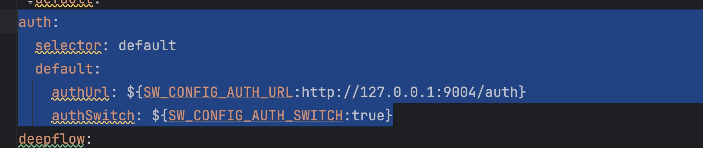
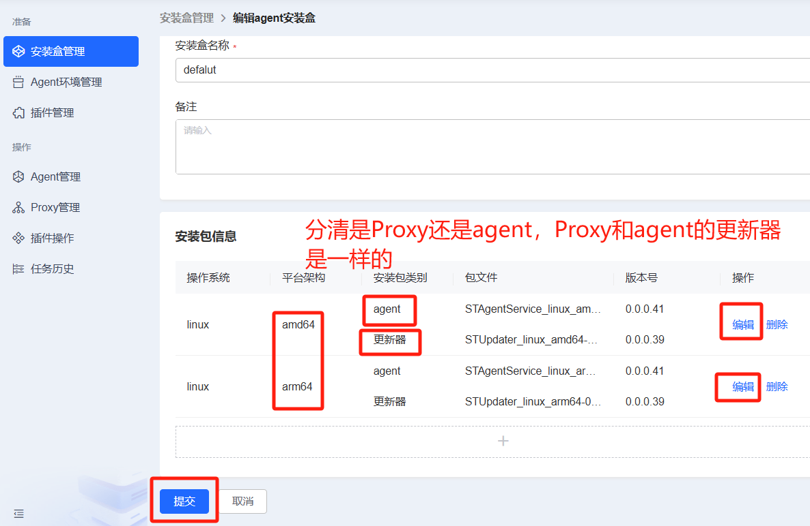

## 1. 权限系统升级
### 备份数据库
手动备份数据库
### 执行升级脚本
#### 若使用 Mysql数据库，执行 SQL：

SQL文件地址：发布包 / 05_升级脚本 / aiops_resource_V4.0.9_to_V4.1.0-upgrader-mysql.sql

#### 若使用达梦数据库，执行 SQL：

SQL文件地址：发布包 / 05_升级脚本 / aiops_resource_V4.0.9_to_V4.1.0-upgrader-dm.sql

#### 若使用Doris数据库，执行 SQL：

SQL文件地址：发布包 / 05_升级脚本 / aiops_resource_V4.0.9_to_V4.1.0-upgrader-doris.sql
### 升级auth-all 组件
#### 停止auth-all进程并备份部署包
``` 
cd /path/auth-all/
./run.sh stop
cd ..
mv auth-all auth-all.bak
```
#### 上传新部署包并解压
``` 
unzip auth-all.zip
cd auth-all
```
#### 将备份包中的config下的bootstrap.yml复制到新的部署包中
``` 
cp /path/auth-all.bak/config/bootstrap.yml ./config/bootstrap.yml
```
### 修改application.yaml配置文件
* 在nacos管理台上修改group是auth-all的application.yaml 文件
1. 在inner:auth 同级增加apiPermission:excludeUrls配置
``` 
inner:
  apiPermission:
    excludeUrls: /auth/workspace,/auth/guideState,/auth/userBaseInfo,/auth/updateUser,/auth/updatePassword,/auth/menu,/graphql/getTimeInfo
```
2. 在配置最后增加management相关配置
``` 
management:
  endpoints:
    enabled-by-default: false
  endpoint:
    health:
      enabled: true
```
3. 配置国密相关配置(只有温州可观测需要执行)
1) 在inner:auth:excludeUrls配置后增加/initCipherData配置
``` 
inner:
  auth:
    excludeUrls: /login,/captcha,/logout,/refreshToken,/loginInfo,/authChange,/authentication/authorization/applications,/authentication/authorization/dataGroups,
    /authentication/authorization/dataGroupName,/permission/**,/metaAndMenu/**,/initCipherData # 认证和授权不进行拦截的路径
```
2) 在security:select 后修改成haitai
``` 
security:
  select: haitai #default=不开启加密 san=三未信安加密  haitai=海泰加密
```
3) sign配置后，和san配置同等级增加haitai相关配置
``` 
sign: 
  haitai:
    keyId: 45def5d8dc82452db034311f17ec602f  #数据唯一密钥，可以不传，不传海泰平台会自己生成，会使得同一个字符多次加密后的字符串不一致，获取的话可以通过postman调用海泰的密钥生成接口获取
    appCode: 9549e2d10c3b406bb5f6ac7bd07d2fba #应用code,需要海泰管理员创建发放
    url: http://127.0.0.1:18849 #机密性海泰密码服务平台地址
    integralityUrl: http://127.0.0.1:8083  #完整性海泰密码服务平台地址
```

### 启动服务
``` 
./run.sh start
```

### 启动成功验证
* 检查./logs下有没有错误日志和查看auth-all进程是否被拉起

``` 
ps -ef |grep auth-all
```

### 未加密数据初始化（只有温州可观测需要执行）
* 执行 curl --location --request POST 'http://127.0.0.1:9004/auth/initCipherData'  进行历史数据初始化 127.0.0.1 替换成auth-all 服务所在地址

## 2. 日志服务系统升级

### **_第一步_**：查找原部署安装目录

```
jps -l | grep st-logplatform-service.jar #获取进程id
pwdx 进程id #获取部署目录
```

### **_第二步_**：停止并备份原服务

在日志服务 st-logplatform-service 目录下执行

`sh run.sh stop #停止日志服务`

回到上层目录执行备份

`mv st-logplatform-service st-logplatform-service.bak
`

### **_第三步_**：部署 4.1.0 版本包并修改配置文件

解压部署包

`unzip st-logplatform-service.zip`

进入解压后的目录

`cd st-logplatform-service`

删除 config 下的.yml 文件

`rm -rf config/*.yml`

从备份包中复制 config 下的.yml 文件到当前 config 下

`cp /path/st-logplatform-service.bak/config/*.yml ./config`


修改nacos上的配置，`application-startrace.yml`文件需要修改的内容如下（此处仅列举了待改项，非全部参数。注意行缩进与配置文件保持一致）：

````
# 删除配置：删除management这一级及下级属性（如果存在）
management:
  endpoints.web.exposure.include: 'prometheus' # 暴露/actuator/prometheus
  metrics.tags.application: ${spring.application.name} # 暴露的数据中添加application label
  health:
    elasticsearch:
      enabled: false #关闭es健康自测，防止doris启动报错

# 新增配置（健康检查）
management:
  endpoints:
    enabled-by-default: false
  endpoint:
    health:
      enabled: true
  health:
    elasticsearch:
      enabled: false #关闭es健康自测，防止doris启动报错
````

启动服务

`sh run.sh start`

## 3. 告警升级

### 准备

```
1、新的部署包alarm-all.zip：
发布包 / 03_公共包 / 02_服务部署包 / alarm-all.zip
2、数据库升级脚本：
发布包 / 05_升级脚本 / alarm-all-V4.0.9-to-V4.1.0-upgrade-dm.sql
发布包 / 05_升级脚本 / alarm-all-V4.0.9-to-V4.1.0-upgrade-mysql.sql
发布包 / 05_升级脚本 / alarm-all-V4.0.9-to-V4.1.0-upgrade-doris.sql
```

### 停服

```
# 获取进程id
[root@master ~]# jps -l | grep alarm-all
11410 /data/service/alarm-all/alarm-all-1.0.jar

# 获取部署目录（此处路径是示例）
[root@master ~]# pwdx 11410
11410: /data/service/alarm-all

# 停服
[root@master ~]# cd /data/service/alarm-all
[root@master alarm-all]# ./run.sh stop

# 检查进程已不存在
[root@master alarm-all]# jps -l | grep alarm-all
[root@master alarm-all]#
```

### 数据库调整

#### 备份数据库

手动备份数据库

#### 执行升级脚本

##### 告警分析Doris数据库，执行 SQL：

SQL文件地址：发布包 / 05_升级脚本 / alarm-all-V4.0.9-to-V4.1.0-upgrade-doris.sql

##### 告警管理数据库，若使用 Mysql数据库，执行 SQL：

SQL文件地址：发布包 / 05_升级脚本 / alarm-all-V4.0.9-to-V4.1.0-upgrade-mysql.sql

##### 告警管理数据库，若使用达梦数据库，执行 SQL：

SQL文件地址：发布包 / 05_升级脚本 / alarm-all-V4.0.9-to-V4.1.0-upgrade-dm.sql

### 告警组件更新

**_第一步_**：停服（前面步骤已实现停服）

**_第二步_**：备份

```
# 进入alarm-all上级目录（此处路径是示例）
[root@master alarm-all]# cd /data/service/

# 改名作备份
[root@master service]# mv alarm-all alarm-all.bak
```

**_第三步_**：部署升级包

将发布包里的`alarm-all.zip`上传到`/data/service/`下，解压后会生成`alarm-all`文件夹。

1、解压：

```
[root@iflyops-1 service]# cd /data/service/
[root@iflyops-1 service]# unzip alarm-all.zip
```

**_第四步_**：配置 bootstrap.yml 文件修改(需要使用新包里的 bootstrap.yml 文件，格式有调整)

```
[root@iflyops-1 service]# cd /data/service/alarm-all/config
[root@iflyops-1 config]# vim bootstrap.yml
```

- 修改如下三个配置为对应环境的 nacos 配置（此处仅列举了待改项，非全部参数）

```
CONFIG_NACOS_SERVER_ADDR: 127.0.0.1:8848
CONFIG_NACOS_USERNAME: nacos
CONFIG_NACOS_PASSWORD: qLQ6lrSoBkKytbVp
```

**_第五步_**：修改 Nacos 配置

1、备份：通过 Nacos 管理台页面，配置管理/配置列表/导出查询结果，导出命名空间 st-observable 下所有配置。

2、Naocs 上配置列表，在命名空间 st-observable 下，编辑 Group 为 alarm-all,Data Id 为 application.yml 的文件，需要修改的内容如下（此处仅列举了待改项，非全部参数。注意行缩进与配置文件保持一致）：

```
# 修改接口拦截配置（替换指定属性includeUrls全值）
manager:
  auth:
    includeUrls: /assign/policy/**,/block/rule/**,/notice/**,/custom/label/**,/label/tpl/**,/event/**,/monitor/system/**,/notify/channel/**,/decision/condition/**,/notify/group/**,/notify/policy/**,/alarm/**,/statistics/**,/auth/**,/analysis/**,/top/dataGroup

# 新增配置（健康检查）
management:
  endpoints:
    enabled-by-default: false
  endpoint:
    health:
      enabled: true

# 删除配置：删除disruptor这一级及下级属性（如果存在）
analyser:
  disruptor:
    queue:
      size: 32768
    consumer:
      num:
        recover: 5
        alarm: 50
```

**_第五步_**：启动服务

```
[root@iflyops-1 service]# cd /data/service/alarm-all
[root@iflyops-1 alarm-all]# sh run.sh start
```

**_第六步_**：访问验证

- alarm-all 服务正常启动

```
ps -ef | grep alarm-all
```

**_第七步_**：失败回滚

1、停服 alarm-all

2、还原告警分析备份库，及告警管理备份库

3、还原修改的 nacos 配置

4、还原 alarm-all 备份包，重启

## 4. nodeman 服务升级

**_第一步_**：停止并备份原服务

```
#停止服务
sh stop.sh
#备份
mv st_nodeman st_nodeman_xxx_bak
```

**_第二步_**：文件替换

从发布包里获取新包，根据 cpu 架构选择 amd64 或者 arm64 部署包，将部署包 nodeman_service_amd64.zip或者nodeman_service_arm64.zip 直接在 nodeman-service 目录下解压, 解压过程中需要替换的文件：

st_nodeman 

installv3.sh （此文件是新增的，原来的installv2.sh可以删除，也可以不删）

install_proxyv3.sh（此文件是新增的，原来的install_proxyv2.sh可以删除，也可以不删）

**_第三步_**：修改配置

Nacos中st-observable空间下编辑Group为nodeman-service，Data ld为config.json的配置，在其中的Redis配置下加一行配置："redisType": "sentinel"，该字段根据你的Redis是单节点、哨兵、集群配置：

单节点：配空字符串 ""；

哨兵："sentinel";

集群："cluster";

加的时候不要漏掉逗号，是json格式。

```
 "redis": {
    "addrs": "127.0.0.1:26379,127.0.0.2:26379,127.0.0.3:26379",
    "password": "**********",
    "masterName": "master6379",
    "redisType": "sentinel"
  },
```


**_第四步_**：将服务重新启动

```bash
sh start.sh
```

**_第五步_**：验证服务

```bash
ps -ef | grep st_nodeman
```

可以查看到相关进程，说明更新成功

**_第六步_**：到发布包 /05_升级脚本下取nodeman_dm.sql或nodeman_mysql.sql执行，SQL需要再nodeman启动后执行。


**_失败回滚_**

1、检查服务进程，关闭后删除升级包，并还原备份包和配置，再启动

## 5. gse 服务升级

**_第一步_**：修改配置
Nacos中st-observable空间下编辑Group为gse-service，Data ld为config.json的配置，在其中的Redis配置下加一行配置："redisType": "sentinel"，该字段根据你的Redis是单节点、哨兵、集群配置：

单节点：配空字符串 ""；

哨兵："sentinel";

集群："cluster";

加的时候不要漏掉逗号，是json格式。

```
 "redis": {
    "addrs": "127.0.0.1:26379,127.0.0.2:26379,127.0.0.3:26379",
    "password": "**********",
    "masterName": "master6379",
    "redisType": "sentinel"
  },
```

**_第二步_**：停止并备份原服务

```
#停止服务
sh stop.sh
#备份
mv st_gse st_gse_xxx_bak
```

**_第三步_**：文件替换：

从发布包里获取新包，根据 cpu 架构选择 amd64 或者 arm64 部署包，将部署包gse_service_amd64.zip或者gse_service_arm64.zip 直接在 gse-service 目录下解压, 解压过程中只需要替换 st_gse 文件就行，其他不用替换。

**_第四步_**：将服务重新启动

```bash
sh start.sh
```

**_第五步_**：验证服务

```bash
ps -ef | grep st_gse
```

可以查看到相关进程，说明部署成功

**_失败回滚_**

1、检查服务进程，关闭后删除升级包，并还原备份包和配置，再启动。

## 6 N9E 升级

**_第一步_**：查找原部署安装目录

```
#获取进程id
ps -ef |grep n9e
#获取部署目录
pwdx 进程id
```

**_第二步_**：停止并备份原服务

```
#停止n9e服务
./stop.sh
# 进入部署目录进行备份
mv n9e n9e_bak
cp -r integrations integrations_bak
```

**_第三步_**：替换可执行文件

```
从发布包里获取新包，根据cpu架构选择n9e_amd64.zip或n9e_arm64.zip对应升级包，解压后将目录下的n9e文件复制到原n9e目录下，替换之前的；
```

**_第四步_**：执行更新 sql

```
1、若数据库是mysql，需要到发布包 /05_升级脚本下取update_n9e_mysql.sql脚本执行；
2、若数据库是达梦库，需要到发布包 /05_升级脚本下取update_n9e_dm.sql脚本执行；
```

**_第五步_**：启动 n9e 服务

```
#进入n9e目录，执行命令
sh start.sh
```

**_第六步_**：验证服务是否启动

```bash
ps -ef |grep n9e
```

可以查看到相关进程，说明部署成功


## 7. 调用链系统升级

**_第一步_**：查找原部署安装目录

```
#获取进程id
jps -l | grep skywalking
#获取部署目录
pwdx 进程id
```

**_第二步_**：停止并备份原部署包

```
#停止调用链服务
kill -9 进程id
# 进入部署目录进行备份
mv apache-skywalking-apm-bin apache-skywalking-apm-bin.bak
```

**_第三步_**：部署 4.1.0 版本包并修改配置文件

1. 根据机器系统架构分别到 01_X86 架构的包或者 02_ARM 架构的包下找服务部署包

- 下文以 arm 系统架构的包名为例

```
解压部署包
tar -zxvf apache-skywalking-apm-bin-arm.tar.gz
进入解压后的目录
cd apache-skywalking-apm-bin-arm
```

2. 将备份包中的 config 下的 application.yml 复制到当前目录

```
cp -r /path/apache-skywalking-apm-bin.bak/config/application.yml ./config/application.yml
```

3. 检查 application.yml 配置文件是否包含 auth 配置项 如果没有请添加
修改application.yml 中的authUrl指向正确的auth-all(权限服务),如果auth-all是多节点部署可配置成ng代理地址
authSwitch 表示是否开启鉴权
```
auth:
  selector: default
  default:
    authUrl: ${SW_CONFIG_AUTH_URL:http://127.0.0.1:9004/auth}
    authSwitch: ${SW_CONFIG_AUTH_SWITCH:true}
```

具体配置位置如图所示：

4. 如果使用doris做为存储引擎   升级时需要检查 application.yml 配置文件是否包含doris优化相关的配置项，如果没有请添加 （如果使用es请忽略此步骤）
```yaml
storage:
  selector: ${SW_STORAGE:doris}
  doris:
    properties:
      jdbcUrl: ${SW_JDBC_URL:"jdbc:mysql://localhost:9030/skywalking?rewriteBatchedStatements=true&connectTimeout=30000&sessionVariables=group_commit=async_mode&useUnicode=true&characterEncoding=utf8&useTimezone=true&serverTimezone=Asia/Shanghai&useSSL=false&allowPublicKeyRetrieval=true"}
      dataSource.user: ${SW_DATA_SOURCE_USER:root}
      dataSource.password: ${SW_DATA_SOURCE_PASSWORD:}
      dataSource.cachePrepStmts: ${SW_DATA_SOURCE_CACHE_PREP_STMTS:true}
      dataSource.prepStmtCacheSize: ${SW_DATA_SOURCE_PREP_STMT_CACHE_SQL_SIZE:250}
      dataSource.prepStmtCacheSqlLimit: ${SW_DATA_SOURCE_PREP_STMT_CACHE_SQL_LIMIT:2048}
      dataSource.useServerPrepStmts: ${SW_DATA_SOURCE_USE_SERVER_PREP_STMTS:true}
      dataSource.socketTimeout: ${SW_DATA_SOURCE_SOCKET_TIMEOUT:300000}
    metadataQueryMaxSize: ${SW_STORAGE_MYSQL_QUERY_MAX_SIZE:5000}
    maxSizeOfBatchSql: ${SW_STORAGE_MAX_SIZE_OF_BATCH_SQL:2000}
    asyncBatchPersistentPoolSize: ${SW_STORAGE_ASYNC_BATCH_PERSISTENT_POOL_SIZE:4}
    #doris stream load 写入开关 默认为false 起到兼容其他storage作用 若其他storage 缺省该配置则BatchSQLExecutor执行器批量提交不启用doris 的stream load
    dorisStreamLoadSwitch: ${SW_STORAGE_DORIS_STREAM_LOAD_SWITCH:true}
    # doris stream load 最大容忍可过滤（数据不规范等原因）的数据比例,取值范围是0~1,例如:0.1
    dorisStreamLoadMaxFilterRatio: ${SW_STORAGE_DORIS_STREAM_LOAD_MAX_FILTER_RATIO:0}
    # doris 如果 OLAP 表的是 Random Distribution 的数据分布，那么在数据导入的时候可以设置单分片导入模式（将 load_to_single_tablet 设置为 true），那么在大数据量的导入的时候，一个任务在将数据写入对应的分区时将只写入一个分片，这样将能提高数据导入的并发度和吞吐量，减少数据导入和 Compaction 导致的写放大问题，保障集群的稳定性。
    dorisStreamloadLoadToSingleTablet: ${SW_STORAGE_DORIS_STREAM_LOAD_LOAD_TO_SINGLE_TABLET:false}
    # doris stream load 提交端口
    dorisStreamloadPort: ${SW_STORAGE_DORIS_STREAM_LOAD_PORT:8030}
    # 针对Doris segment 热点表 执行攒批处理的线程数
    segmentTheadSize: ${SEGMENT_THREAD_SIZE:2}
    # 针对Doris segment_tag 热点表 执行攒批处理的线程数
    segmentTagThreadSize: ${SEGMENT_TAG_THREAD_SIZE:4}
    # Doris segment 热点表 最大攒批长度
    segmentDorisBatchSqlMaxSize: ${SEGMENT_DORIS_BATCH_SQL_MAX_SIZE:3000}
    # Doris segment_tag 热点表 最大攒批长度
    segmentTagDorisBatchSqlMaxSize: ${SEGMENT_TAG_DORIS_BATCH_SQL_MAX_SIZE:10000}
```
5. 修改配置后 访问doris管理台http://localhost:8030 创建skywalking库 执行以下sql
```bash
DROP TABLE IF EXISTS skywalking.segment;
DROP TABLE IF EXISTS skywalking.segment_tag;
```
执行定制化建表语句，新增分区策略提高写入效率：
```bash
CREATE TABLE IF NOT EXISTS `segment`
(
    `date_partition`      datetime(6)  NULL COMMENT '分区字段',
    `id`                  varchar(512) NULL,
    `segment_id`          varchar(150) NULL,
    `trace_id`            varchar(150) NULL,
    `service_id`          varchar(200) NULL,
    `service_instance_id` varchar(512) NULL,
    `endpoint_id`         varchar(512) NULL,
    `start_time`          bigint       NULL,
    `latency`             int          NULL,
    `is_error`            int          NULL,
    `data_binary`         text         NULL,
    `time_bucket`         bigint       NULL,
    INDEX idx_segment_id (`segment_id`) USING INVERTED PROPERTIES("parser" = "english", "support_phrase" = "true", "lower_case" = "true") COMMENT 'segment_id 倒排索引',
    INDEX idx_trace_id (`trace_id`) USING INVERTED PROPERTIES("parser" = "english", "support_phrase" = "true", "lower_case" = "true") COMMENT 'trace_id 倒排索引',
    INDEX idx_service_id (`service_id`) USING INVERTED PROPERTIES("parser" = "english", "support_phrase" = "true", "lower_case" = "true") COMMENT 'service_id 倒排索引',
    INDEX idx_service_instance_id (`service_instance_id`) USING INVERTED PROPERTIES("parser" = "english", "support_phrase" = "true", "lower_case" = "true") COMMENT 'service_instance_id 倒排索引',
    INDEX idx_endpoint_id (`endpoint_id`) USING INVERTED PROPERTIES("parser" = "english", "support_phrase" = "true", "lower_case" = "true") COMMENT 'endpoint_id 倒排索引'
)
ENGINE = OLAP UNIQUE KEY(`date_partition`,`id`)
PARTITION BY RANGE(`date_partition`)()
DISTRIBUTED BY HASH(`id`) BUCKETS 28
PROPERTIES (
"dynamic_partition.enable" = "true",
"dynamic_partition.time_unit" = "DAY",
"dynamic_partition.create_history_partition" = "true",
"dynamic_partition.history_partition_num" = "7",
"dynamic_partition.start" = "-30",
"dynamic_partition.end" = "7",
"dynamic_partition.prefix" = "p",
"dynamic_partition.replication_allocation" = "tag.location.default: 1",
"compression" = "ZSTD",
"compaction_policy" = "size_based",
"group_commit_interval_ms" = "60000",
"group_commit_data_bytes" = "268435456"
);

CREATE TABLE IF NOT EXISTS `segment_tag`  
(  
    `date_partition` datetime(6)  NULL COMMENT '分区字段',
    `id`             varchar(512) NULL,    
    `service_id`     varchar(200) NULL,  
    `tags`           varchar(256) NULL,  
    `time_bucket`    bigint       NULL  
)  
ENGINE = OLAP  
UNIQUE KEY(`date_partition`,`id`)  
PARTITION BY RANGE(`date_partition`)()  
DISTRIBUTED BY HASH(`id`) BUCKETS AUTO  
PROPERTIES (  
"dynamic_partition.enable" = "true",  
"dynamic_partition.time_unit" = "DAY",  
"dynamic_partition.create_history_partition" = "true",  
"dynamic_partition.history_partition_num" = "7",  
"dynamic_partition.start" = "-30",  
"dynamic_partition.end" = "7",  
"dynamic_partition.prefix" = "p",  
"dynamic_partition.replication_allocation" = "tag.location.default: 1",  
"compression" = "ZSTD",  
"compaction_policy" = "size_based",
"group_commit_interval_ms" = "60000",
"group_commit_data_bytes" = "134217728"
);
```

**_第四步_**：启动服务 #在 apache-skywalking-apm-bin/bin 目录下执行启动命令

```
sh oapService.sh
```

**_第五步_**：启动成功验证

- 检查./logs 下有没有错误日志和查看 oap 进程是否被拉起

```
ps -ef |grep oap
```

## 8. 前端升级

**备注：**nginx 部署需要 nginx 添加--with-http_ssl_module、--with-http_v2_module 、--with-http_gzip_static_module 和--with-http_stub_status_module 模块。可以通过以下命令查看当前 nginx 是否已安装这些模块

```
cd /**/**/nginx/
./sbin/nginx -V
```

如果没有安装，需要重新编译安装 nginx。安装过程中执行以下命令进行编译

```
./configure --prefix=/data/public/nginx --with-http_ssl_module --with-http_v2_module --with-http_gzip_static_module --with-http_stub_status_module
```

nginx安装过程如有疑问可以参考中间部署文档中nginx部署教程

### 升级说明

前端包里包含 observe-basic-app.zip、observe-config.zip、observe-metric.zip、observe-trace.zip、observe-log.zip、observe-alarm.zip、sop_doc.zip 七个前端资源文件和 nginx.conf 一个 nginx 配置文件。

第一步：进入旧版的前端资源包目录下，将旧版资源包 micro_front_observer 进行备份，并删除旧版资源包 micro_front_observer；

第二步：建立新的前端资源包文件夹；

```
mkdir micro_front_observer
cd ./micro_front_observer
mkdir observe-basic-app
mkdir observe-config
mkdir observe-metric
mkdir observe-trace
mkdir observe-log
mkdir observe-alarm
mkdir sop_doc
```

第三步：将前端资源包上传至部署机器。将 observe-basic-app.zip、observe-config.zip、observe-metric.zip、observe-trace.zip、observe-log.zip、observe-alarm.zip、sop_doc.zip 七个前端资源包分别上传至上面对应的文件夹目录下，分别解压资源文件；

第四步：进入/micro_front_observer/observe-basic-app 目录下，打开**config.js**文件， production 对象里**127.0.0.1**改为前端资源包所在部署机器的 ip 或域名；

```json
    "production": {
        "VITE_DOC_URL": "http://127.0.0.1/sop_doc/", // 文档中心部署地址
        "VITE_LOGIN_CONFIG": {
            "mode": "normal", // "normal": 本地登陆 / "sso": sso登陆 / "uap": uap登陆
            "sso_url": "https://ssotest.iflytek.com/sso",
            "uap_url": "http://127.0.0.1:8380/uap-server",
            "app_code": "yy_1704868151449",
            "client_platform": "myuap"
        },
    },
```

第五步：进入/nginx/config 目录下，将原有的 nginx.conf 文件进行备份一份；

第六步：打开nginx.conf 文件，在原有基础上,在server里增加两项配置，预防头部攻击和点击劫持风险；

```shell
#前端nginx配置
server {
        ....
        listen       80;

        if ($http_Host !~* ^ip$) { # ip为服务器实际ip地址或者域名，多个条件通过`|`间隔，用于预防host头攻击
          return 403;
        }
        

        location / {
            ...
            add_header X-Frame-Options SAMEORIGIN; #禁用被其他站点iframe嵌入
         }
       ...
}
```

第七步：在 nginx 目录下执行./sbin/nginx -s reload 重启 nginx，执行 ps aux | grep nginx 命令显示有 NGINX 的进程即启动成功，可通过部署 NGINX 的服务器 IP 访问星迹可观测平台

```
./sbin/nginx -s reload
ps aux | grep nginx
```

### 验证

访问项目查看是否正常运行

### 失败回滚

删除升级包，还原备份资源包及 nginx 配置文件，重启 nginx，访问前端页面

## 9. Proxy、Agent、更新器 升级

**_第一步_**：更新安装盒

在可观测页面--环境配置--安装盒管理中，选择安装盒点编辑更新Proxy、agent、更新器的包。

**每个安装盒** 根据类型（Proxy、agent）上传新包。在安装包页面，编辑安装包信息，删除旧的 Agent 或Proxy安装包附件、更新器附件，然后上传新版本对应架构的包（ amd64 和 arm64 ），最后点击保存 --- 提交。



**_第二步_**：更新 Agent

方法一：更新完安装盒后，系统会自动升级，但是要等 Agent 的自更新程序检测到有新版本才会自动升级，大概在一小时之后；
方法二：在 Agent 管理页面点击批量更新操作来完成升级，可以在任务历史菜单里查看更新是否成功，也可以在 Agent 管理页查看 Agent 的版本号是否为最新版本。

**_第三步_**：更新 Proxy

方法一：更新完安装盒后，系统会自动升级，但是要等 Proxy的自更新程序检测到有新版本才会自动升级，大概在一小时之后；
方法二：在 Proxy管理页面点击批量更新操作来完成升级，可以在任务历史菜单里查看更新是否成功，也可以在 Proxy管理页查看 Proxy的版本号是否为最新版本。


## 10. datasleuth 插件升级

1. 在可观测--环境配置--插件管理页面编辑 datasleuth 插件，将 datasleuth 新版本的包更新上去，并检查确认勾选了备份配置，配置目录为 conf.d；
2. 在可观测--环境配置--插件操作中批量选择插件，下一步之后选择 datasleuth 插件更新。
3. 在可观测--历史任务页面查看升级是否成功；在可观测--环境配置--插件操作中检查插件版本时候更新成功；

## 11. st_vector 插件升级

1. 在可观测--环境配置--插件管理页面编辑 st_vector 插件，将 st_vector 新版本的包更新上去，并检查确认勾选了备份配置，配置目录为 /config；
2. 点击提交进行插件包更新。
3. 在可观测--环境配置--插件管理--日志插件详情--插件包信息中检查插件版本是否更新成功；