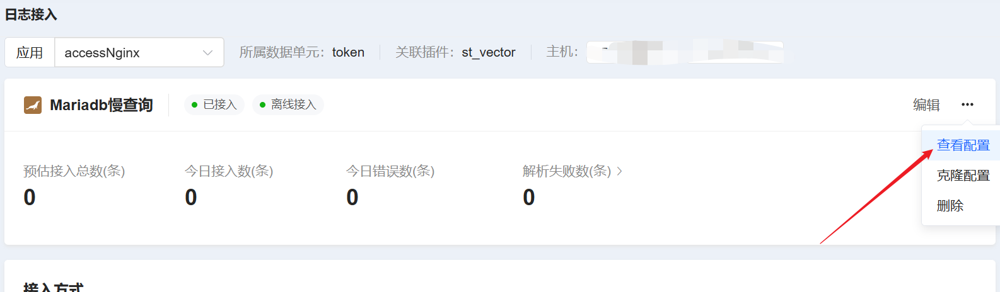
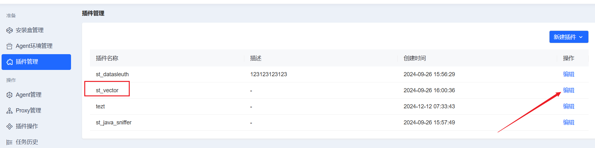
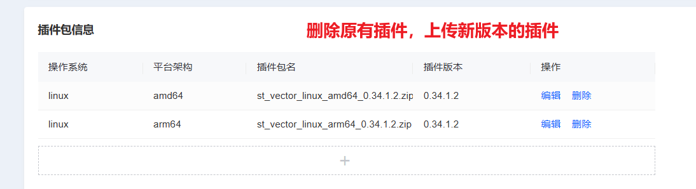
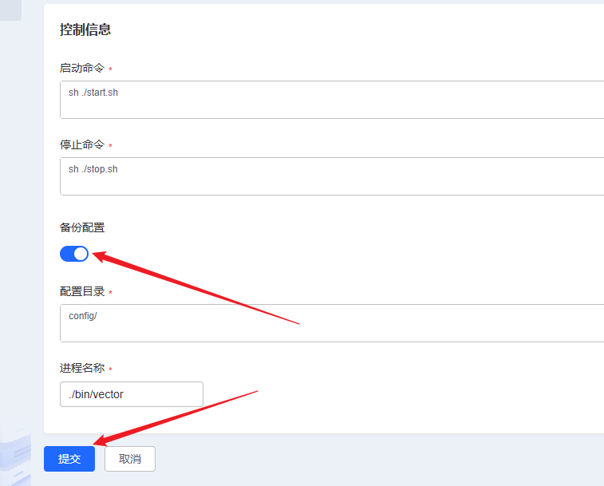
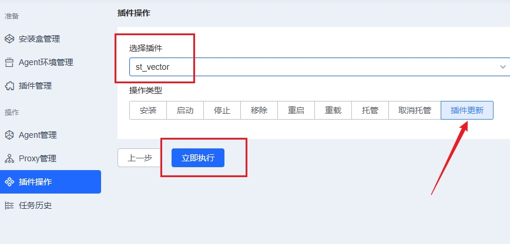
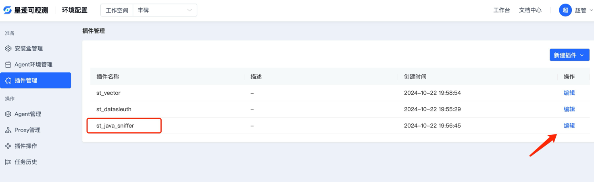
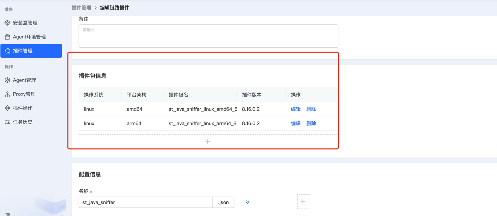
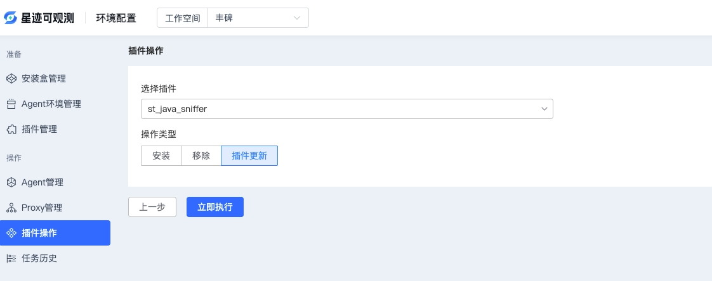

## 1. 权限系统升级

### 准备

```
1、新的部署包auth-all.zip：
发布包 / 03_公共包 / 02_服务部署包 / auth-all.zip

2、数据库升级脚本：
发布包 / 05_升级脚本 / auth-all-V4.1.0-to-V4.1.1-upgrade-dm.sql
发布包 / 05_升级脚本 / auth-all-V4.1.0-to-V4.1.1-upgrade-mysql.sql
发布包 / 05_升级脚本 / auth-all-V4.1.0-to-V4.1.1-upgrade-doris.sql

3、备份Nacos配置

4、备份数据库aiops_resource
```

### 停服

```
# 获取进程id
[root@master ~]# jps -l | grep auth-all
11410 /data/service/auth-all/auth-all.jar

# 获取部署目录（此处路径是示例）
[root@master ~]# pwdx 11410
11410: /data/service/auth-all

# 停服
[root@master ~]# cd /data/service/auth-all
[root@master auth-all]# ./run.sh stop

# 检查进程已不存在
[root@master auth-all]# jps -l | grep auth-all
[root@master auth-all]#
```

### 执行升级脚本

#### 备份数据库

手动备份数据库

#### 执行升级脚本

##### 若使用 Mysql数据库，执行 SQL：

SQL文件地址：发布包 / 05_升级脚本 / auth-all-V4.1.0-to-V4.1.1-upgrade-mysql.sql

##### 若使用达梦数据库，执行 SQL：

SQL文件地址：发布包 / 05_升级脚本 / auth-all-V4.1.0-to-V4.1.1-upgrade-dm.sql

##### 若使用Doris数据库，执行 SQL：

SQL文件地址：发布包 / 05_升级脚本 / auth-all-V4.1.0-to-V4.1.1-upgrade-doris.sql

### 升级auth-all 组件

**_第一步_**：停服（前面步骤已实现停服）

**_第二步_**：备份
```
# 进入auth-all上级目录（此处路径是示例）
[root@master auth-all]# cd /data/service/

# 改名作备份
[root@master service]# mv auth-all auth-all.bak
```

**_第三步_**：部署升级包

将发布包里的`auth-all.zip`上传到`/data/service/`下，解压后会生成`auth-all`文件夹。

1、解压：
```
[root@iflyops-1 service]# cd /data/service/
[root@iflyops-1 service]# unzip auth-all.zip
```

**_第四步_**：将备份包中的config下的bootstrap.yml复制到新的部署包中覆盖
``` 
cp /data/service/auth-all.bak/config/bootstrap.yml /data/service/auth-all/config/
# 选择覆盖：y
```

**_第五步_**：修改Nacos配置文件

1、备份：通过 Nacos 管理台页面，配置管理/配置列表/导出查询结果，导出命名空间 st-observable 下所有配置（已备份则跳过）。

2、Naocs 上配置列表，在命名空间 st-observable 下，编辑 Group 为 auth-all,Data Id 为 application.yaml 的文件，需要修改的内容如下（此处仅列举了待改项，非全部参数。注意行缩进与配置文件保持一致）：
```yaml
# 1、删除配置：
mybatis-plus:
  configuration:
    log-impl: org.apache.ibatis.logging.stdout.StdOutImpl
  mapper-locations: classpath:/mapper/**/*.xml

# 2、增加配置
# 部署方式 single独立部署，all非独立部署。默认all，有独立部署需求的再改。
deploy_mode: all

# 3、更新配置（仅替换列举的这个属性值）
inner:
   apiPermission:
      excludeUrls: /auth/workspace,/auth/guideState,/auth/userBaseInfo,/auth/updateUser,/auth/updatePassword,/auth/menu
```

**_第六步_**：启动服务
```
[root@iflyops-1 service]# cd /data/service/auth-all
[root@iflyops-1 auth-all]# sh run.sh start
```

**_第七步_**：启动成功验证
* 检查./logs下有没有错误日志和查看auth-all进程是否被拉起
``` 
ps -ef |grep auth-all
```

**_第七步_**：失败回滚

1、还原修改的 nacos 配置

2、还原 auth-all 备份包，重启


## 2. 日志服务系统升级

### **_第一步_**：停止和备份原服务

查找原部署安装目录:

````bash
#获取进程id
jps -l | grep st-logplatform-service.jar 
#获取部署目录
pwdx 进程id 
````

停止原服务，在日志服务 st-logplatform-service 目录下执行:

````bash
sh run.sh stop
````

备份原服务，回到上层目录执行备份

````bash
mv st-logplatform-service st-logplatform-service.bak
````

### **_第二步_**：部署 4.1.1 版本包并修改配置文件

解压部署包：

````bash
unzip st-logplatform-service.zip
````

进入解压后的目录：

````bash
cd st-logplatform-service
````

删除 config 下所有的 `.yml` 文件：

````bash
rm -rf config/*.yml
````

从备份包中复制 config 下所有的的 `.yml` 文件到当前 config 目录下：

````bash
cp /path/st-logplatform-service.bak/config/*.yml ./config
````

修改当前 config 目录下的 `bootstrap-startrace.yml` 文件（一处修改，仅列举了待改项，非全部参数，注意行缩进与配置文件保持一致）：

````yaml
spring:
  application:
    name: st-logplatform-service
  cloud:
    nacos:
      config:
        server-addr: ${st-log-platform.nacos.server-addr}
        username: ${st-log-platform.nacos.username}
        password: ${st-log-platform.nacos.password}
        namespace: ${st-log-platform.nacos.config-namespace}
        group: ${st-log-platform.nacos.group}
        file-extension: yml # 修改此处为yml
        refresh-enabled: true
        enabled: true
        extension-configs:
          - data-id: config-custom.yml
            group: ${st-log-platform.nacos.group}
          - data-id: application-startrace.yml
            group: ${st-log-platform.nacos.group}
      discovery:
        server-addr: ${st-log-platform.nacos.server-addr}
        username: ${st-log-platform.nacos.username}
        password: ${st-log-platform.nacos.password}
        namespace: ${st-log-platform.nacos.discovery-namespace}
        enabled: true
````

修改 nacos 上的 `application-startrace.yml` 配置文件，需要修改的内容如下（在配置文件中增加一处，仅列举了待改项，非全部参数，注意行缩进与配置文件保持一致）：

````yaml
st-log-platform:
  config:
    kafka:
      log-record-topic: log_record_topic
      consumer:
        topics-to-listen:
    xxl-job:
      enabled: true
      accessToken: aafb230a-1bef-411d-8853-5f3d4edebb95
    storage:
      type: doris
    stack-error: # 增加
      type: regex # 增加，错误堆栈信息解析方式
  auth-enable: true
````

### **_第三步_**：启动项目并请求更新接口

1. 启动服务：

    ````bash
    sh run.sh start
    ````

2. 提供服务升级接口，请求后自动进行更新，使用说明：
   
- 修改好本地的 `bootstrap-startrace.yml`和nacos上的`application-startrace.yml`配置文件
- 请求upgrade接口

    ````bash
    #请求命令
    curl http://127.0.0.1:8100/log-platform/upgrade/upgrade
    
    #请求返回
    {"success":true,"data":"升级到4.1.1成功","errorCode":null,"errorMessage":null}
    ````

3. 请求upgrade接口成功后，可观测能正常登录，日志接入页面可正常进入，即为成功。

### **_第四步_**：升级离线应用的vector

针对采用离线方式接入的日志应用，需要手动增加全局环境变量并修改 vector 的配置文件。

1. 新增全局环境变量：

用于设置主机ip地址，创建脚本文件，`vim addHostIp.sh`，文件内容为：

````bash
#!/bin/bash
# 检查 ~/.bashrc 文件中是否已经包含 HOST_IP 设置，如果没有则添加
if ! grep -q "HOST_IP=" ~/.bashrc; then
echo "HOST_IP=$(hostname -I | awk '{print $1}')" >> ~/.bashrc
echo "HOST_IP is set in ~/.bashrc"
else
echo "HOST_IP is already set in ~/.bashrc"
fi
# 重新加载 ~/.bashrc 以使修改生效
source ~/.bashrc
# 确保 HOST_IP 环境变量在当前 shell 会话中可用
export HOST_IP=$HOST_IP
# 输出当前设置的 HOST_IP
echo "HOST_IP is set to: $HOST_IP"
````
  
成功执行后输出：
   
````bash
[root@master service]# vim addHostIp.sh 
[root@master service]# sh addHostIp.sh 
HOST_IP is set in ~/.bashrc
HOST_IP is set to: 127.0.0.1
````
  
2. 手动更新离线接入应用的 vector 配置文件：

用于vector采集上报日志数据时，携带主机ip地址。在日志接入的页面，查看当前离线接入应用的最新配置文件：



将当前离线接入应用的配置文件复制后，登录到应用所在机器。覆盖原有的vector配置文件后，按照以下的命令重新启动vector：

````bash
#获取进程id
ps -ef | grep vector 
#杀死进程id
kill -9 pid
#进入vector所在目录，重新启动vector
./bin/vector --config config/vector.json -w
````

## 3. 告警升级

### 准备

```
1、新的部署包alarm-all.zip：
发布包 / 03_公共包 / 02_服务部署包 / alarm-all.zip

2、数据库升级脚本：
发布包 / 05_升级脚本 / alarm-all-V4.1.0-to-V4.1.1-upgrade-dm.sql
发布包 / 05_升级脚本 / alarm-all-V4.1.0-to-V4.1.1-upgrade-mysql.sql

3、备份Nacos配置

4、备份数据库：告警管理Mysql/DM数据库aiops_alarm，告警分析Doris库不用备份。
```

### 停服

```
# 获取进程id
[root@master ~]# jps -l | grep alarm-all
11410 /data/service/alarm-all/alarm-all-1.0.jar

# 获取部署目录（此处路径是示例）
[root@master ~]# pwdx 11410
11410: /data/service/alarm-all

# 停服
[root@master ~]# cd /data/service/alarm-all
[root@master alarm-all]# ./run.sh stop

# 检查进程已不存在
[root@master alarm-all]# jps -l | grep alarm-all
[root@master alarm-all]#
```

### 数据库调整

#### 备份数据库

手动备份数据库

#### 执行升级脚本

##### 告警管理数据库，若使用 Mysql数据库，执行 SQL：

SQL文件地址：发布包 / 05_升级脚本 / alarm-all-V4.1.0-to-V4.1.1-upgrade-mysql.sql

##### 告警管理数据库，若使用达梦数据库，执行 SQL：

SQL文件地址：发布包 / 05_升级脚本 / alarm-all-V4.1.0-to-V4.1.1-upgrade-dm.sql

### 告警组件更新

**_第一步_**：停服（前面步骤已实现停服）

**_第二步_**：备份

```
# 进入alarm-all上级目录（此处路径是示例）
[root@master alarm-all]# cd /data/service/

# 改名作备份
[root@master service]# mv alarm-all alarm-all.bak
```

**_第三步_**：部署升级包

将发布包里的`alarm-all.zip`上传到`/data/service/`下，解压后会生成`alarm-all`文件夹。

1、解压：

```
[root@iflyops-1 service]# cd /data/service/
[root@iflyops-1 service]# unzip alarm-all.zip
```

**_第四步_**：将备份包中的config下的bootstrap.yml复制到新的部署包中覆盖
``` 
cp /data/service/alarm-all.bak/config/bootstrap.yml /data/service/alarm-all/config/
# 选择覆盖：y
```

**_第五步_**：修改 Nacos 配置

1、备份：通过 Nacos 管理台页面，配置管理/配置列表/导出查询结果，导出命名空间 st-observable 下所有配置。

2、Naocs 上配置列表，在命名空间 st-observable 下，编辑 Group 为 alarm-all,Data Id 为 application.yml 的文件，需要修改的内容如下（此处仅列举了待改项，非全部参数。注意行缩进与配置文件保持一致）：

```
# 更新配置（仅替换列举的这个属性）
manager:
  auth:
    includeUrls: /assign/policy/**,/block/rule/**,/notice/**,/custom/label/**,/label/tpl/**,/event/**,/monitor/system/**,/notify/channel/**,/decision/condition/**,/notify/group/**,/notify/policy/**,/alarm/**,/statistics/**,/auth/**,/analysis/**,/top/dataGroup

# 删除配置（删除disruptor这一级及下级属性）
notify:
  disruptor:
    queue:
      size: 1024
    consumer:
      num:
        mail: 3
        qywechat: 3
```

**_第五步_**：启动服务

```
[root@iflyops-1 service]# cd /data/service/alarm-all
[root@iflyops-1 alarm-all]# sh run.sh start
```

**_第六步_**：访问验证

- alarm-all 服务正常启动

```
ps -ef | grep alarm-all
```

**_第七步_**：失败回滚

1、停服 alarm-all

2、还原告警管理备份库

3、还原修改的 nacos 配置

4、还原 alarm-all 备份包，重启

### 升级完成后需通过告警页面调整的内容

```text
1、因告警等级增加为5级，依次为“信息、警告、次要、重要、严重”。如果分派策略、屏蔽策略条件涉及告警级别，需调整相应条件配置。
不调整将仅按照前三级做判断。

2、因告警等级增加为5级，通知方式的通知模板内，涉及告警等级的部分需做相应调整，否则如果告警是第5级，会导致模板转换失败。
可选择根据“文档中心/操作指南/智能告警/通知方式操作文档”提供的默认模板重置配置。或者在现有通知模板上做修改，以下是调整范例：

如短信的：
    级别状态: ${level?switch(1, '信息', 2, '警告', 3, '重要')}，  
需改为：
    级别状态: ${level?switch(1, '信息', 2, '警告', 3, '次要', 4, '重要', 5, '严重')}
    
邮件的：
    <th>级别状态：</th>
    <#switch level>
        <#case 1>
            <td>信息 recovered</td>
            <#break>
        <#case 2>
            <td>警告 recovered</td>
            <#break>
        <#case 3>
            <td>重要 recovered</td>
            <#break>
        <#default>
            <#break>
    </#switch>
需改为：
    <th>级别状态：</th>
    <#switch level>
        <#case 1>
            <td>信息 recovered</td>
            <#break>
        <#case 2>
            <td>警告 recovered</td>
            <#break>
        <#case 3>
            <td>次要 recovered</td>
            <#break>
        <#case 4>
            <td>重要 recovered</td>
            <#break>
        <#case 5>
            <td>严重 recovered</td>
            <#break>
        <#default>
            <#break>
    </#switch>
    
3、原“文档中心/操作指南/智能告警/通知方式操作文档”提供的邮件通知模板，存在告警内容content元素值过长时，导致邮件格式变形的问题，
可根据当前版本操作文档重置邮件通知模板，或手动进行调整：

增加css样式，在style标签内增加，style内其他样式保持不变
<style type="text/css">
    .alarm-content{
        white-space: wrap;
        word-break: break-all;
    }
</style>

通知内容引用样式，防止内容过长导致邮件格式错位
将：
    <tr>
        <th>内容：</th>
        <td>${content}</td>
    </tr>
改为：
    <tr class="alarm-content">
        <th>内容：</th>
        <td>${content}</td>
    </tr>
```

## 4. nodeman 服务升级

**_第一步_**：停止并备份原服务

```
#停止服务
sh stop.sh
#备份
mv st_nodeman st_nodeman_xxx_bak
```

**_第二步_**：文件替换

从发布包里获取新包，根据 cpu 架构选择 amd64 或者 arm64 部署包，将部署包 nodeman_service_amd64.zip或者nodeman_service_arm64.zip 直接在 nodeman-service 目录下解压, 解压过程中替换st_nodeman文件

**_第三步_**：将服务重新启动

```bash
sh start.sh
```

**_第四步_**：验证服务

```bash
ps -ef | grep st_nodeman
```

可以查看到相关进程，说明更新成功

**_失败回滚_**

1、检查服务进程，关闭后删除升级包，并还原备份包和配置，再启动

## 6 N9E 升级

**_第一步_**：查找原部署安装目录

```
#获取进程id
ps -ef |grep n9e
#获取部署目录
pwdx 进程id
```

**_第二步_**：停止并备份原服务

```
#停止n9e服务
./stop.sh
# 进入部署目录进行备份
mv n9e n9e_bak
cp -r integrations integrations_bak
```

**_第三步_**：替换可执行文件

```
从发布包里获取新包，根据cpu架构选择n9e_amd64.zip或n9e_arm64.zip对应升级包，解压后将目录下的以下文件替换/新增到原n9e目录下：
（1）n9e二进制文件
（2）integrations文件夹
注意：integrations文件夹会重置内置仪表盘，如果存在手动加入的内置仪表盘，需提前备份，并且，部分内置仪表盘增加了集群名称变量，指标接入时需参考相应接入手册
（3）template文件夹
（4）rum.yaml文件
```

**_第四步_**：执行更新 sql

```
1、若数据库是mysql，需要到发布包 /05_升级脚本下取update_n9e_mysql.sql脚本执行；
2、若数据库是达梦库，需要到发布包 /05_升级脚本下取update_n9e_dm.sql脚本执行；
3、到发布包 /05_升级脚本下取update_n9e_doris.sql脚本,打开doris在线客户端（doris提供一个web客户端，可以执行SQL），在客户端中执行update_n9e_doris.sql脚本；
```

**_第五步_**：修改配置

打开Nacos页面，在st-observable空间下编辑Group为n9e-service，Data ld为config.toml的配置，在配置后面添加如下配置，并将其中的IP、端口、用户名、密码改为正确的配置：

```
[Center]
RumYamlFile = "rum.yaml"

[Doris.Datasource]
DSN="user:password@tcp(127.0.0.1:9030)/n9e?charset=utf8mb4&parseTime=True&loc=Local&allowNativePasswords=true"
Debug = true
DBType = "doris"
MaxLifetime = 7200
MaxOpenConns = 150
MaxIdleConns = 50
TablePrefix = ""

[Doris.StreamLoad]
Host="127.0.0.1"
Port="8030"
Database="n9e"
User="user"
Password="password"
MaxFilterRatio=0.0
LoadToSingleTablet=false
MergeMaxSizeMb=70
MergeMaxWaitSecond=60
ConcurrentOperatorCount=10
FileKeepHour=48

[Extend]
TargetExportMaxDays=7
```

**_第六步_**：启动 n9e 服务

```
#进入n9e目录，执行命令
sh start.sh
```

**_第七步_**：验证服务是否启动

```bash
ps -ef |grep n9e
```

可以查看到相关进程，说明部署成功


## 7. 前端升级

**备注：**nginx 部署需要 nginx 添加--with-http_ssl_module、--with-http_v2_module 、--with-http_gzip_static_module 和--with-http_stub_status_module 模块。可以通过以下命令查看当前 nginx 是否已安装这些模块

```
cd /**/**/nginx/
./sbin/nginx -V
```

如果没有安装，需要重新编译安装 nginx。安装过程中执行以下命令进行编译

```
./configure --prefix=/data/public/nginx --with-http_ssl_module --with-http_v2_module --with-http_gzip_static_module --with-http_stub_status_module
```

nginx安装过程如有疑问可以参考中间部署文档中nginx部署教程

### 升级说明

前端包里包含 observe-basic-app.zip、observe-config.zip、observe-metric.zip、observe-trace.zip、observe-log.zip、observe-alarm.zip、sop_doc.zip 七个前端资源文件和 nginx.conf 一个 nginx 配置文件。

第一步：进入旧版的前端资源包目录下，将旧版资源包 micro_front_observer 进行备份，并删除旧版资源包 micro_front_observer；

第二步：建立新的前端资源包文件夹；

```
mkdir micro_front_observer
cd ./micro_front_observer
mkdir observe-basic-app
mkdir observe-config
mkdir observe-metric
mkdir observe-trace
mkdir observe-log
mkdir observe-alarm
mkdir sop_doc
```

第三步：将前端资源包上传至部署机器。将 observe-basic-app.zip、observe-config.zip、observe-metric.zip、observe-trace.zip、observe-log.zip、observe-alarm.zip、sop_doc.zip 七个前端资源包分别上传至上面对应的文件夹目录下，分别解压资源文件；

第四步：进入/micro_front_observer/observe-basic-app 目录下，打开**config.js**文件， production 对象里**127.0.0.1**改为前端资源包所在部署机器的 ip 或域名；

```json
    "production": {
        "VITE_DOC_URL": "http://127.0.0.1/sop_doc/", // 文档中心部署地址
        "VITE_LOGIN_CONFIG": {
            "mode": "normal", // "normal": 本地登陆 / "sso": sso登陆 / "uap": uap登陆
            "sso_url": "https://ssotest.iflytek.com/sso",
            "uap_url": "http://127.0.0.1:8380/uap-server",
            "app_code": "yy_1704868151449",
            "client_platform": "myuap"
        },
    },
```

第五步：在 nginx 目录下执行./sbin/nginx -s reload 重启 nginx，执行 ps aux | grep nginx 命令显示有 NGINX 的进程即启动成功，可通过部署 NGINX 的服务器 IP 访问星迹可观测平台

```
./sbin/nginx -s reload
ps aux | grep nginx
```

### 验证

访问项目查看是否正常运行

### 失败回滚

删除升级包，还原备份资源包及 nginx 配置文件，重启 nginx，访问前端页面

## 8. datasleuth 插件升级

1. 在可观测--环境配置--插件管理页面编辑 datasleuth 插件，将 datasleuth 新版本的包更新上去，并检查确认勾选了备份配置，配置目录为 conf.d；

2. 在可观测--环境配置--插件操作中批量选择插件，下一步之后选择 datasleuth 插件更新。

3. 在可观测--历史任务页面查看升级是否成功；在可观测--环境配置--插件操作中检查插件版本时候更新成功；

## 9. datasleuth-k8s 升级

1. 删除原来的资源：

   ```
   kubectl delete  -f  datasleuth.yaml
   ```

2. 上传新版本镜像；

3. 替换 datasleuth.yaml 文件，按照部署文档修改 datasleuth.yaml 文件中的配置，按照部署文档的步骤重新部署 datasleuth-k8s。

## 10. datasleuth-windows 升级

1. 解压 st_datasleuth_windows_amd64_1.0.0.10.zip 文件，将其中的 st_datasleuth.exe 替换老的 st_datasleuth.exe 文件，然后重启插件即可。启动方式如下：

   ```
   方式一：
   启动：双击st_datasleuth.exe启动，该方式启动不能关闭cmd窗口，否则进程会停止。
   停止：关掉cmd窗口
   方式二：
   启动：在powershell中执行Start-Process -WindowStyle hidden -FilePath '双击st_datasleuth.exe'
   停止：在任务管理器的进程中找到双击st_datasleuth，并结束。
   ```


## 11. st_vector 插件升级

如果应用日志接入方式为在线接入，请求升级接口后，vector 采集数据可能会出现错误，需要对 vector 升级，获取升级的 `st_vector_linux_xxx64_0.34.1.2` 包，在环境管理中升级。升级步骤为：

- 星迹可观测平台主页面--环境配置--插件管理：



- 删除原有插件，上传最新插件



- 点击提交进行插件包上传，其余地方无需改动，记得打开备份配置：



- 星迹可观测平台主页面--环境配置--插件操作--选择对应的机器agent--选择st_vector插件--插件更新：


## 12. st_java_sniffer 插件升级
调用链升级了agent 插件包，可在环境配置中升级，或手动部署升级。环境配置-插件管理升级步骤如下：

- 删除原有插件，上传最新插件

- 到插件操作页面，选择主机，进行插件更新



